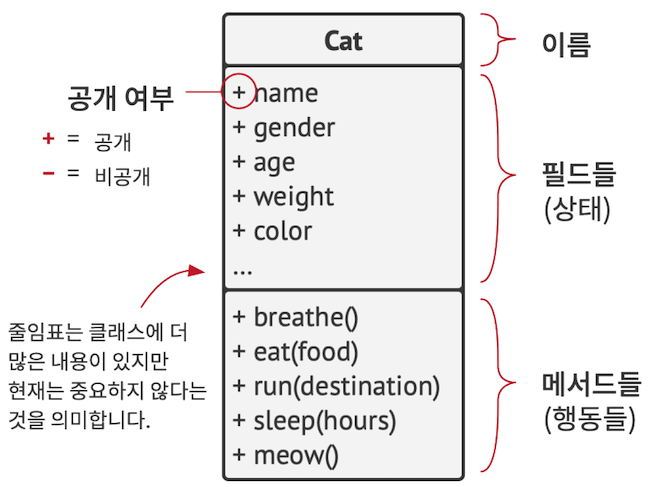
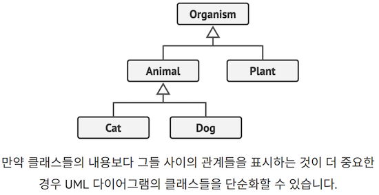
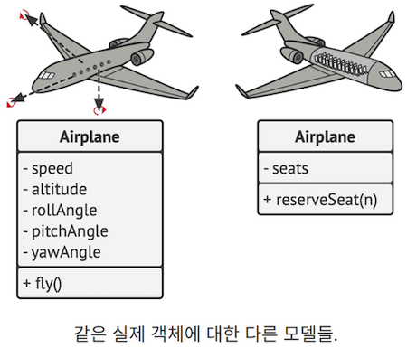
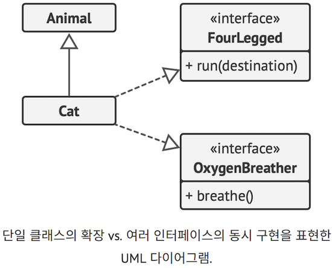
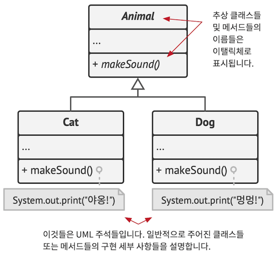
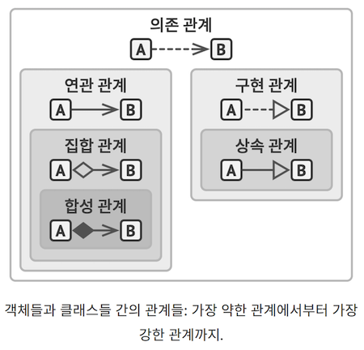

# 1. OOP의 기초

* OOP라고도 불리는 객체 지향 프로그래밍(Object Oriented Programing)
* 데이터 조각들 및 해당 데이터와 관련된 행동들을 객체라는 특수한 묶음으로 모은다는 개념에 기반한 이론적인 틀 또는 체계
* 객체들은 클래스라고 하는 프로그래머가 정의한 '청사진'들의 집합으로 구성됩니다.

------

## 1.1 객체들, 클래스들

고양이 좋아하시나요? 다양한 고양이 예시를 사용하여 OOP라는 개념을 설명해 보겠습니다



오스카라는 고양이가 있다고 가정해 봅시다. 오스카는 객체이며, Cat (고양이) 클래스의 인스턴스입니다. 
각 고양이는 **이름, 성별, 나이, 체중, 색깔, 좋아하는 음식 같은 일반적인 속성들**을 많이 갖고 있습니다. 
이러한 속성들을 `클래스의 필드들`이라고 합니다

> 이 책에서 저는 클래스 이름을 UML 다이어그램이나 코드에 쓰인 것처럼 영어로 언급할 겁니다. 
> 하지만 때로는 글이 대화처럼 읽힐 수 있게 클래스 이름을 한국어로 번역하여 언급할 수도 있으니 유념해 주세요.

모든 고양이는 비슷하게 행동합니다. **숨을 쉬고, 먹고, 뛰고, 자고, 야옹 소리를 내며 웁니다**. 
이것들은 `클래스의 메서드들`입니다. 필드들과 메서드들을 통틀어 해당 `클래스의 멤버들`이라고 부릅니다.

> 객체의 필드들의 내부에 저장된 데이터는 종종 상태라고 불리며, 
> 객체의 모든 메서드들은 객체의 행동들을 정의합니다.

당신의 친구의 고양이인 루나 역시 Cat (고양이) 클래스의 인스턴스입니다.
루나는 오스카와 같은 속성의 집합을 가지고 있습니다. 이 둘의 차이점은 그들이 가진 이러한 속성들의 값이 다르다는 것입니다. 
예를 들어, 루나의 성별은 여성이고 색깔이 다르며 오스카보다 몸무게가 적습니다.


따라서 클래스는 객체들의 구조를 정의하는 청사진과 비슷하며, 
객체들은 이 클래스의 구상 인스턴스들입니다

------

## 1.2 클래스 계층구조들

한 클래스에 관해 이야기할 때는 모든 것이 간단하고 명확합니다. 
그러나 대부분 실제 프로그램에는 하나 이상의 클래스가 포함되어 있습니다.
이러한 클래스 중 일부는 클래스 계층구조로 구성될 수 있으며, 지금부터는 그것이 무엇을 의미하는지 살펴보겠습니다.

이웃에 이름이 '파이도'인 개가 있다고 가정해 봅시다. 개와 고양이는 공통점이 많습니다. 
이름, 성별, 나이, 색깔은 개와 고양이 모두의 속성입니다. 개는 고양이처럼 숨을 쉬고, 잠을 자고, 달릴 수도 있습니다.
그렇게 우리도 기초 Animal (동물) 클래스를 정의한 뒤 동물들의 일반적인 속성과 행동을 나열할 수 있을 것 같습니다.


방금 정의한 것과 같은 상위 클래스를 `부모 클래스`라고 합니다.
그 하위에 있는 클래스들을 `자식 클래스`들이라고 합니다. 
자식 클래스들은 부모로부터 상태와 행동들을 상속받고, 그중에서 부모와 무언가 다른 것들만을 정의합니다.
그래서 Cat (고양이) 클래스에는 meow (야옹) 메서드가 있고, 
Dog (강아지) 클래스에는 bark (멍멍 짖는) 메서드가 있게 됩니다.

연관된 비즈니스 요구사항이 있다면, 
여기서 더 나아가 Organisms (모든 생명체들)라는 더욱 일반적인 클래스를 추출할 수도 있습니다.
이 클래스는 Animals (동물들) 및 Plants (식물들)에 대한 부모 클래스가 될 것입니다.
이런 클래스들의 피라미드가 바로 계층구조입니다. 
이러한 계층구조에서 Cat (고양이) 클래스는 Animal (동물)과 Organism (생명체) 클래스 양쪽의 모든 내용을 상속받습니다.



**자식 클래스들은 부모 클래스들에서 상속한 메서드들의 행동**을 `오버라이드`할 수 있습니다.
또 자식 클래스들은 **디폴트 행동들을 완전히 대체하거나 몇 가지 행동들을 추가**하여 그 기능들을 향상시킬 수 있습니다.

------

# 2. OOP의 기둥들

객체 지향 프로그래밍(OOP)은 OOP를 다른 프로그래밍 틀 또는 체계들과 차별화하는 4가지 기둥, 
즉 기본 개념들을 기반으로 합니다.


------

## 2.1 추상화

대부분의 경우 OOP를 사용하여 프로그램을 만들 때는 실생활에 존재하는 객체들을 기반으로 프로그램의 객체들을 형성합니다. 
그러나 프로그램의 객체들은 실제 원본 객체들의 속성들을 100% 정확하게 나타내지 않고, 대부분 그럴 필요도 없습니다.
대신 프로그램의 객체들은 특정 맥락에서만 실제 객체들의 속성들과 행동들을 모델링하고 나머지들은 무시합니다.

예를 들어 Airplane (비행기) 클래스는 비행 시뮬레이터와 항공 좌석 예약 앱 모두에 존재할 수 있습니다. 
그러나 비행시뮬레이터가 실제 비행과 관련된 세부 정보들을 담고 있다면, 
항공 좌석 예약 앱에서 사람들이 신경쓰는 건 좌석 배치도와 예약 가능한 좌석들 같은 정보들뿐입니다



추상화는 맥락에 따라 핵심적인 개념 또는 기능들로 제한되는 실제 객체 또는 현상의 모델이며, 
이 맥락과 관련된 모든 세부 정보는 높은 정확도로 나타내고 나머지는 모두 생략합니다

------

## 2.2 캡슐화

자동차 엔진을 시동하려면 버튼을 누르거나 키를 돌리기만 하면 됩니다. 
후드 아래에 있는 전선들을 연결하고, 크랭크축과 실린더를 회전시켜 엔진의 전원 사이클을 시작할 필요가 전혀 없습니다. 

왜냐하면 이러한 세세한 작업들은 자동차의 후드 아래에 숨겨져 있기 때문입니다. 
운전자에게 있는 건 시동 스위치, 핸들, 그리고 몇 개의 페달이라는 단순한 `인터페이스`가 전부입니다.
이것은 각 객체가 인터페이스를 갖는 방식을 설명해줍니다.
인터페이스는 다른 객체와 상호작용할 수 있는 객체의 공개된 부분입니다.

캡슐화는 객체가 그 상태와 행동의 일부를 다른 객체들로부터 숨기고, 
나머지 프로그램에는 제한된 인터페이스만 노출할 수 있는 기능입니다.

무언가를 캡슐화한다는 것은 그것을 `private (비공개)`로 만든다는 뜻으로, 
그러면 그 무언가를 자신의 클래스의 메서드 내에서만 접근할 수 있습니다.
조금 덜 제한적인 `protected (보호된)` 접근제한자라는 것도 있는데,
이것은 클래스의 멤버를 자식 클래스들에서도 사용할 수 있게 해줍니다.

대부분의 프로그래밍 언어의 인터페이스들, 추상 클래스들, 그리고 추상 메서드들은 추상화 및 캡슐화 개념들에 기반을 둡니다. 
현대 OOP 언어들에서의 인터페이스 메커니즘 (일반적으로 interface 또는 protocol 키워드로 선언됨)은 
객체 간의 상호 작용에 대한 계약을 정의할 수 있도록 합니다. 
이는 인터페이스들이 객체들의 행동에만 관심을 두는 이유 중 하나이자, 
당신이 인터페이스에서 필드를 선언할 수 없는 이유입니다.

> 인터페이스라는 단어는 객체의 공개된 부분을 나타냅니다. 
> 동시에 대부분의 프로그래밍 언어에는 interface 라는 유형도 있지요. 
> 이 사실이 매우 혼란스럽다는 사실을 저는 잘 이해하고 있습니다.


`fly(origin, destination, passengers)` ((출발지, 목적지, 승객)을 인수로 받는 비행) 메서드가 있는 `FlyingTransport` (비행 운송 수단) 인터페이스가 있다고 가정해 봅시다.

항공 운송 시뮬레이터를 설계할 때, 

* 당신은 Airport (공항) 클래스를 FlyingTransport 인터페이스를 구현하는 객체들과만 작동하도록 제한할 수 있습니다. 
* 이렇게 만들고 나면 airplane (비행기)이든, Helicopter (헬리콥터)든, 
  아니면 DomesticatedGryphon (집에서 키운 독수리사자)이든, 
* 공항 객체에 전달된 어떤 객체라도 이러한 유형의 공항에서 이착륙할 수 있을 거라고 확신할 수 있습니다.

또 당신은 이러한 클래스들의 fly 메서드에 대한 구현을 원하는 방식으로 변경할 수 있습니다. 
메서드의 시그니처들이 인터페이스에 선언된 것들과 같게 유지되는 한 
Airport 클래스의 모든 인스턴스는 당신의 비행 객체들과 잘 작동할 수 있습니다.

------

## 2.3 상속

상속은 기존 클래스들 위에 새 클래스들을 구축하는 기능입니다. 상속의 가장 큰 이점은 코드 재사용입니다.
기존 클래스와 약간 다른 클래스를 만들고 싶을 때 기존 코드를 복제할 필요가 없죠. 
그 대신 기존(부모) 클래스를 확장한 후 
부모 클래스의 필드들과 메서드들을 상속한 결과 자식 클래스에 필요한 추가 기능들을 추가하면 됩니다.

상속을 사용하면 결과적으로 자식 클래스들이 부모 클래스와 같은 인터페이스를 갖게 됩니다.
어떤 메서드가 부모 클래스에서 선언되었다면 자식 클래스에서 그 메서드를 숨길 수 없습니다.
또한 자식 클래스들에 어울리지 않는 추상 메서드들을 포함하여 모든 추상 메서드들을 구현해야 합니다.



대부분의 프로그래밍 언어에서 자식 클래스는 하나의 부모 클래스만 확장할 수 있습니다. 
반면에 모든 클래스가 동시에 여러 인터페이스를 구현할 수 있죠. 
하지만 앞서 언급했듯이 부모 클래스가 인터페이스를 구현한다면 모든 자식 클래스들 또한 그 인터페이스를 구현해야 합니다.

------

## 2.4 다형성

이제 동물에 대한 예시를 살펴봅시다. 대부분의 `Animals` (동물들)는 소리를 낼 수 있습니다.
따라서 우리는 모든 자식 클래스들이 기초 `makeSound` (소리내기) 메서드를 오버라이드해야 
각 자식 클래스가 그에 해당하는 동물의 소리를 올바르게 낼 수 있다고 예상할 수 있습니다.

그러므로 우리는 이 메서드를 바로 추상 으로 선언할 수 있습니다. 
이렇게 하면 부모 클래스에서 이 메서드의 디폴트 구현을 생략할 수 있습니다.
하지만 모든 자식 클래스들은 강제적으로 이 메서드를 각자 구현해야 합니다.



이제 당신이 큰 가방에 여러 고양이와 개들을 넣었다고 가정해 봅시다. 
그런 다음 눈을 감은 상태에서 가방에서 동물들을 하나씩 꺼내는 겁니다. 
가방에서 동물을 꺼낸 직후 당신은 그 동물이 어떤 동물인지 확실히 모릅니다.
하지만 그 동물을 힘껏 껴안아 본다면 이 동물은 그 구상 클래스에 따라 특정한 소리를 낼 것입니다.

```js
bag = [new Cat(), new Dog()];

foreach (Animal a : bag)
	a.makeSound()

// 야옹!
// 멍멍!
```

프로그램은 a 변수 안에 포함된 객체의 구상 유형을 알지 못합니다. 
하지만 다형성이라는 특별한 메커니즘 덕분에, 
프로그램은 그 메서드가 실행되어 적절한 행동들을 실행하는 객체의 자식 클래스를 추적할 수 있습니다

다형성은 객체의 실제 클래스를 감지하고, 
해당 객체의 구현을 현재 맥락에서 이것의 실제 유형을 알 수 없는 경우에도 호출할 수 있는 프로그램의 기능입니다.

다형성은 객체가 다른 무언가인 척 '가장'을 할 수 있는 기능이라고도 생각할 수 있습니다.
일반적으로는 객체가 확장하는 클래스 또는 구현하는 인터페이스인 척 가장합니다.
위 예시에서는 가방에 든 개와 고양이가 일반적인 동물인 척 가장하고 있었습니다.

------

# 3. 객체 간의 관계

전에 설명한 상속 및 구현 외에도 객체들 사이에는 다른 유형의 관계들이 있습니다

## 3.1 의존성


`의존성`은 클래스 간의 가장 기본적이고 약한 유형의 관계입니다.
**한 클래스의 정의를 일부 변경했을 때 다른 클래스가 변경되는 경우 두 클래스 사이에 의존성이 있다**고 할 수 있습니다.
의존성은 일반적으로 코드에서 구상 클래스 이름들을 사용할 때 만들어집니다. 
(예: 메서드 시그니처 유형들을 지정할 때, 생성자 호출들을 통해 객체들을 인스턴스화할 때 등). 
당신의 코드를 구상 클래스가 아닌 인터페이스나 추상 클래스에 의존하게 만들면 의존성을 약화할 수 있습니다.

일반적으로 UML 다이어그램은 모든 의존 관계를 표시하지 않습니다. 
왜냐하면 실제 코드에는 너무나도 많은 의존 관계들이 있기 때문입니다.
따라서 의존 관계로 다이어그램을 복잡하게 만드는 대신, 
나타내고자 하는 아이디어에 중요한 관계들만 매우 선별적으로 표시해야 합니다

------

## 3.2 연관 관계


`연관`은 **한 객체가 다른 객체를 사용하거나 이 두 객체가 상호 작용하는 관계**입니다. 
UML 다이어그램에서 연관 관계는 한 객체에서 그 객체가 사용하는 객체로 향하는 **간단한 화살표로 표시**됩니다. 
참고로 양방향 연관 관계는 완전히 정상적이며, 이 경우 화살의 양 끝에 화살표가 있습니다. 
연관은 특수한 종류의 의존관계로 간주할 수 있으며, 이때 객체는 언제나 상호작용하는 객체에 접근할 수 있습니다. 
반면 단순한 의존관계에서는 객체 사이의 영구적인 연결이 만들어지지 않습니다.

일반적으로 다른 객체가 포함된 필드를 나타낼 때는 연관관계를 사용합니다. 
이 필드는 두 객체 간의 링크 역할을 합니다. 하지만 늘 필드일 필요는 없습니다. 
연관관계는 일부 객체를 반환하는 메서드로 나타낼 수도 있습니다. 
그렇지 않으면 인터페이스에 필드가 없기 때문에 인터페이스 사이에서 연관관계를 사용할 수 없을 것입니다.

연관 관계와 의존 관계의 차이를 확실히 짚고 넘어갈 수 있게 다른 예를 하나 더 살펴봅시다. 
`Professor` (교수) 클래스가 있다고 가정합시다.

```js
class Professor is
  field Student student
  // ...
  method teach(Course c) is
  // ...
  this.student.remember(c.getKnowledge())
```

이제 `teach` 메서드를 살펴보세요. 
이 메서드는 `Course` (수업 과정) 클래스를 인수로 받으며, 이 인수는 메서드의 본문에서 사용됩니다. 
누군가가 `getKnowledge` 메서드의 시그니처를 변경하면(예: 이름을 바꾼다든지 또는 필요한 매개변수를 추가한다든지 등) 
코드가 더 이상 작동하지 않을 것입니다. 
바로 이것이 `Professor` 클래스가 `Course` 클래스에 의존한다고 말할 수 있는 이유입니다.

이제 `student` 필드를 살펴보고 해당 필드가 `teach` 메서드에서 어떻게 사용되는지도 살펴보세요. 
`Student` 클래스는 `Professor` 클래스에 의존하는 `dependency`라고 확실히 말할 수 있습니다. 
왜냐하면 `remember` 메서드의 시그니처가 변경되면, `Professor`의 코드가 깨지기 때문입니다. 
그러나 `Professor`의 모든 메서드는 student 필드에 접근할 수 있으므로, 
`Student`클래스는 `Professor`에 의존하는 `dependency`일 뿐만이 아니라 `Professor`와 연관 관계가 있기도 합니다.

------

## 3.3 집합 관계


`집합 관계`는 여러 객체 간의 '**일-대-다**', '**다-대-다**' 또는 '**전체-부분**' 관계들을 나타내는 특수한 유형의 연관 관계입니다

일반적으로 집합 관계에서 객체는 다른 객체들의 집합을 '**가지며**', 컨테이너 또는 컬렉션 역할을 합니다. 
컴포넌트는 컨테이너 없이 존재할 수 있으며, 동시에 여러 컨테이너에 연결될 수 있습니다.
UML에서 집합 관계는 **컨테이너 끝에서는 빈 다이아몬드**가 달려있고, 
**컴포넌트를 가리키는 끝부분에서는 화살표가 달린 선**으로 표시됩니다.

UML은 클래스들 간의 관계를 나타냅니다.
이것은 다이어그램에서의 각 사물이 하나의 '블록'만으로 표시되더라도 대학 객체가 여러 학과로 구성될 수 있음을 의미합니다.
UML 표기법에서는 관계의 양쪽에 수량을 표시낼 수 있지만 이 수량이 맥락상 명확하면 생략해도 됩니다.

------

## 3.4 합성 관계


`합성 관계`는 **특정 유형의 집합 관계**로, 여기서 **객체는 다른 객체의 하나 또는 그 이상의 인스턴스로 구성**됩니다. 
합성 관계와 다른 관계들의 차이점은 **컴포넌트가 컨테이너의 일부로만 존재할 수 있다**는 것입니다. 
UML에서 합성 관계는 집합 관계와 동일하게 표시되지만, **화살표에 속이 채워진 다이아몬드**가 추가됩니다.

많은 사람이 `'합성'`이라는 용어를 합성과 집합 관계 모두를 뜻하는 상황에서 사용하곤 합니다. 
그 가장 악명 높은 예시가 바로 '**상속보다 합성을 선택하십시오**'라는 유명한 원칙입니다. 
사람들이 둘 사이의 차이점에 대해 무지해서가 아니라, 
합성을 뜻하는 `composition`(구성)이라는 단어(예: '객체 구성')가 영어에서는 더 자연스럽게 들리기 때문입니다

------

# 4. 큰 그림

이제까지 객체 간의 모든 관계에 대해 살펴보았으므로 이 관계들이 어떻게 연결되었는지 살펴봅시다. 
이 설명이 '집합 관계와 합성 관계의 차이점은 무엇입니까' 또는 
'상속 관계는 의존 관계의 일종입니까'와 같은 질문들에 답이 되었기를 바랍니다.



의연 집합 구상

* `의존 관계`: 클래스 A는 클래스 B가 변경될 때 영향을 받을 수 있습니다.
* `연관 관계`: **객체 А가 객체 B에 대해 알고 있습니다**. 클래스 A는 B에 의존합니다.
* `집합 관계`: 객체 А가 객체 B에 대해 알고 있으며, **B로 구성**됩니다. 클래스 A는 B에 의존합니다.
* `합성 관계`: 객체 А가 객체 B에 대해 알고, B로 구성되며, **B의 수명 주기를 관리**합니다. 클래스 A는 B에 의존합니다.
* `구현 관계`: 클래스 А가 **인터페이스 B에 선언된 메서드를 정의**합니다. 
  * 객체 A는 B처럼 처리될 수 있습니다. 클래스 A는 B에 의존합니다.
* `상속 관계`: 클래스 А가 **클래스 B의 인터페이스 및 구현 관계를 상속하지만 이를 확장**할 수 있습니다.
  * 객체 A는 B처럼 처리될 수 있습니다. 클래스 A는 B에 의존합니다.
