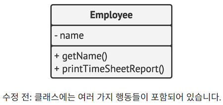
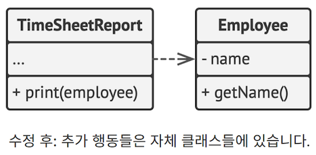
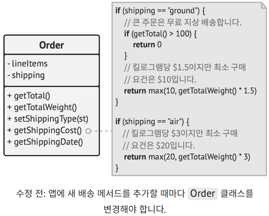
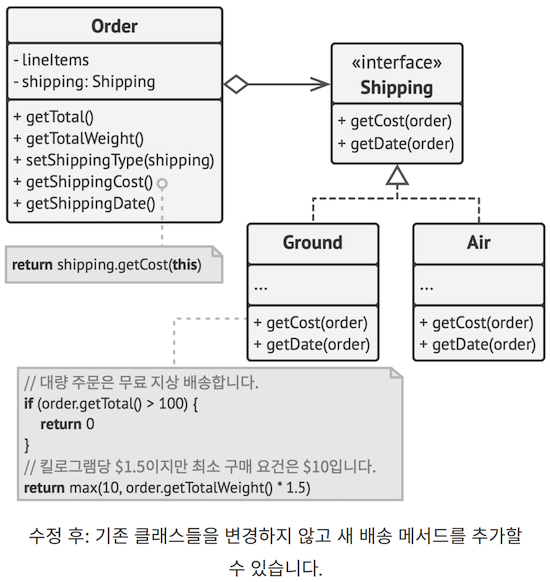
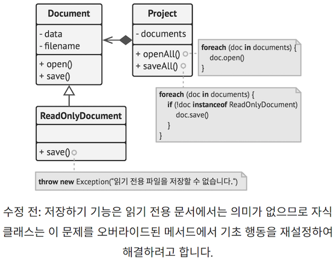
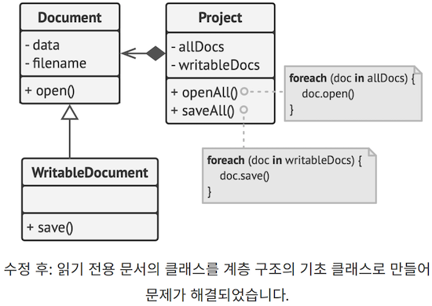
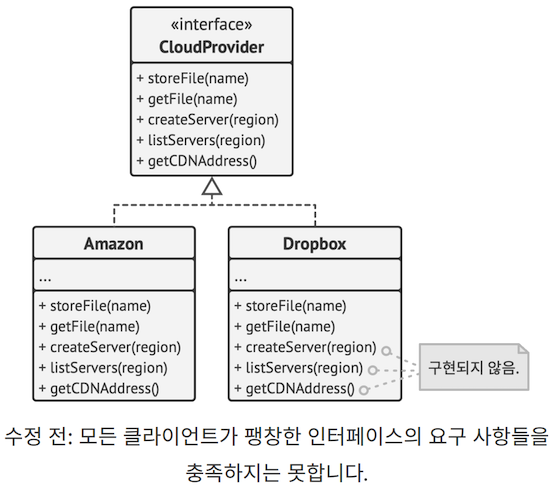
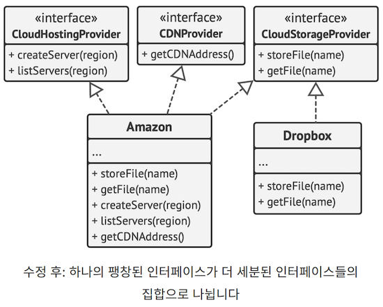
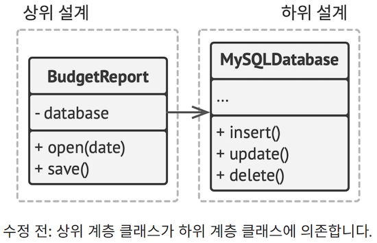
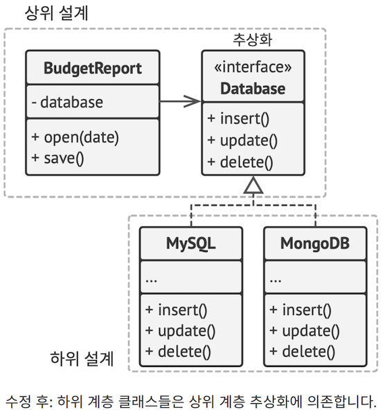

기본 디자인 원칙을 배웠으므로 이제 일반적으로 SOLID 원칙들이라고 알려진 5가지 원칙을 살펴봅시다. 
로버트 마틴은 자신의 책 『소프트웨어 개발의 지혜: 원칙, 디자인 패턴, 실천방법』에서 이 5가지 원칙들을 소개했습니다.

`SOLID`는 소프트웨어 디자인을 보다 이해하기 쉽고 유연하며, 
유지 관리할 수 있도록 만드는 5가지 설계 원칙들에 대한 연상 기호입니다

인생의 모든 것이 그렇듯이 이러한 원칙들을 아무 생각 없이 적용하면 득보다 실이 더 많을 수 있습니다. 
이러한 원칙들을 프로그램의 아키텍처에 적용하면 프로그램이 필요 이상으로 복잡해질 수 있습니다.
또 이 모든 원칙이 동시에 적용되는 성공적인 소프트웨어 제품이 있는지도 의심스럽습니다.
이러한 원칙들을 적용하기 위해 노력하는 것도 좋지만, 
항상 실용적이려고 노력하시고 여기에 쓰인 모든 것을 교리로 받아들이지 마세요

------

# 1. S : 단일 책임 원칙

> Single Responsibility Principle (클래스는 한 가지 이유로 변경되어야 합니다)

각각의 클래스가 프로그램이 제공하는 기능의 한 부분을 책임지도록 하세요. 
그 후 이 책임을 완전히 캡슐화하여 클래스 내부에 숨기세요.

이 원칙의 주목적은 복잡성을 줄이는 것입니다. 코드가 약 200줄에 불과한 프로그램을 위해 정교한 디자인을 만들 필요는 없죠. 
10개의 메서드들을 멋있게 만들면 그걸로 충분합니다.

진짜 문제들은 프로그램이 계속해서 성장하고 변경되면서 나타납니다.
어느 시점에 이르면 클래스들은 너무 커져서 더 이상 그 세부 내용을 기억할 수 없게 될 것입니다.
코드 탐색은 매우 느려질 것이고, 클래스나 프로그램의 전체를 훑어봐야 특정 코드를 찾을 수 있게 되겠죠.
프로그램의 너무 많은 인터페이스, 클래스와 유닛의 수가 두통을 유발하면서,
코드에 대한 통제력을 상실하고 있다고 느끼게 될 것입니다.

또 클래스가 너무 많은 작업을 수행하는 경우, 
그중 하나가 변경될 때마다 클래스를 변경해야 합니다.
그러면 변경할 생각이 없는 클래스의 다른 부분이 망가질 위험이 있습니다.

프로그램의 특정한 측면에 하나하나 집중하기는 것이 어려워지면, 
단일 책임 원칙을 떠올려 클래스를 나눠야 하는 것은 아닌지 확인해 보세요.

------

## 1.1 예시

`Employee` (직원) 클래스는 변경되어야 하는 몇 가지 이유가 있습니다. 
첫 번째 이유는 클래스의 주 작업인 직원 데이터 관리와 관련이 있을 수 있습니다. 다른 이유도 있습니다. 
시간이 흐르면 작업표 보고서의 형식이 변경될 수 있으므로, 그러면 클래스 내에서 코드를 변경해야 합니다.

작업표 보고서의 인쇄와 관련된 행동을 별도의 클래스로 옮겨 문제를 해결하세요. 
이 변경을 통해 다른 보고서 관련 항목들을 새 클래스로 이동할 수 있습니다.

------

# 2. O : 개방/폐쇄 원칙

> Open/Closed Principle (클래스들은 확장에는 열려있어야 하지만 변경에는 닫혀 있어야 합니다.)

이 원칙의 주요 목적은 새로운 기능을 구현할 때 기존 코드가 깨지지 않도록 하는 것입니다.

클래스는 확장할 수 있을 때, 자식 클래스를 생성할 수 있을 때, 
기초 행동을 오버라이드 하고 새로운 메서드나 필드를 추가하는 등 
원하는 모든 작업을 수행할 수 있을 때 open(개방)되어 있다고 할 수 있습니다. 

일부 프로그래밍 언어들은 final 과 같은 특수한 키워드를 사용하여 클래스의 추가 확장을 제한할 수 있습니다.
그 후에는 클래스가 더 이상 개방되어 있지 않을 것입니다. 
동시에 클래스가 다른 클래스에 의해 사용될 준비가 100% 되어 있다면 
해당 클래스는 closed(폐쇄) 또는 완료되었다고 할 수 있습니다.
이때 사용될 준비가 되었다는 것은 인터페이스가 명확하게 정의되어 있으며 미래에 변경되지 않는다는 뜻입니다.

제가 이 원칙에 대해 처음 배웠을 때 저는 혼란스러웠습니다.
왜냐하면 개방과 폐쇄는 서로 공존할 수 없는 조건처럼 들렸기 때문입니다.
그러나 클래스는 확장을 위해 개방됨과 동시에 변경에 대해 폐쇄되어 있을 수 있습니다.

클래스가 이미 개발, 테스트, 검토의 단계를 마쳤고 이미 어떤 프레임워크에 포함되었거나 앱에서 사용되는 경우,
해당 클래스의 코드를 변경하는 것은 위험합니다.
당신은 해당 클래스의 코드를 직접 변경하는 대신 자식 클래스를 만든 후
원래 클래스의 다르게 행동했으면 하는 부분들을 오버라이드할 수 있습니다.
그러면 당신의 목표를 달성하면서도 원래 클래스의 기존 클라이언트를 손상하지 않게 됩니다.

이 원칙은 클래스의 모든 변경 사항에 적용되지 않아도 됩니다. 당신의 클래스에 버그가 있으면 그냥 가서 수정하세요.
그 문제를 수정하려고 자식 클래스를 만들지 말고요. 자식 클래스는 부모 클래스의 문제들에 책임을 져서는 안 됩니다.

------

## 2.1 예시

당신에게는 모든 배송 메서드들이 내부에 하드코딩되어 있으며, 
배송 비용을 계산하는 `Order` (주문) 클래스를 갖는 전자 상거래 앱이 있습니다.
새로운 배송 메서드를 추가하려면 Order 클래스의 코드를 변경해야 하며, 그러면 코드가 깨질 위험이 있습니다.

이 문제는 전략 패턴을 적용하여 해결할 수 있습니다. 일단 배송 메서드들을 공통 인터페이스를 가진 별도의 클래스들로 추출하세요.

이제 새로운 배송 메서드를 구현해야 할 때 `Order` 클래스의 코드를 건드리지 않고, 
`Shipping` (배송) 인터페이스에서 새 클래스를 파생할 수 있습니다. 
`Order` 클래스의 클라이언트 코드는 사용자가 사용자 인터페이스에서 이 배송 메서드들을 선택할 때마다, 
주문을 새 클래스의 배송 객체와 연결할 것입니다.

또 이 해결책을 사용하면 단일 책임 원칙에 따라 
배달 시간 계산 기능을 보다 관련성 높은 클래스들로 이동할 수 있게 해줍니다.

------

# 3. L : 리스코프 치환 원칙

> Liskov Substitution Principle
>
> 클래스를 확장할 때 클라이언트 코드를 손상하지 않고, 
> 자식 클래스의 객체들을 부모 클래스의 객체들로 교체(치환)할 수 있어야 합니다
>
> cf. 이 원칙의 이름은 바바라 리스코프가 1987년 
> 자신의 논문 데이터 추상화와 계층구조에서 정의했습니다. https://refactoring.guru/liskov/dah

이는 자식 클래스가 부모 클래스의 행동과 계속 호환되어야 함을 의미합니다.
메서드를 오버라이드할 때 기초 행동을 다른 행동들로 완전히 교체하는 대신 확장하세요.

리스코프 치환 원칙은 자식 클래스가 과거에 부모 클래스의 객체들과 함께 작동할 수 있었던 코드와 
여전히 호환되는지를 예측하는 데 도움이 되는 일련의 검사들이라고 생각할 수 있습니다.
이 개념은 라이브러리와 프레임워크를 개발할 때 매우 중요합니다.
왜냐하면 당신이 직접 접근하거나 변경할 수 없는 다른 사람들의 코드가 당신의 클래스들을 사용할 것이기 때문입니다.

여러 방식으로 해석이 가능한 다른 디자인 원칙들과는 달리, 리스코프 치환 원칙은 자식 클래스들, 
그리고 특히 그들의 메서드들에 대한 일련의 형식적인 요구사항을 갖습니다. 이 요구 사항을 자세히 살펴보러 가봅시다.

------

(1) **자식 클래스의 메서드의 매개변수 유형들은 부모 클래스의 메서드의 매개변수 유형들보다** 
**더 추상적이거나 추상화 수준이 같아야 합니다**. 

이해가 잘 안 가시나요? 예를 들어보겠습니다. 
고양이에게 먹이를 주는 메서드가 있는 `feed(Cat c)` 라는 클래스가 있다고 가정해 봅시다.
클라이언트 코드는 항상 cat 객체들을 이 메서드에 전달합니다.

* `좋은 코드`: 위 메서드를 오버라이드한 feed(Animal c) 라는 자식 클래스를 생성하여 고양이의 부모 클래스인 모든 동물에게 먹이를 줄 수 있도록 했다고 가정해 봅시다. 
  * 이제 부모 클래스의 객체 대신 이 자식 클래스의 객체를 클라이언트 코드에 전달해도 
  * 모든 것은 여전히 제대로 작동할 것입니다. 
  * 이 메서드는 모든 동물에게 먹이를 줄 수 있으므로 클라이언트가 전달하는 모든 고양이에게 먹이를 줄 수 있습니다
* `나쁜 코드`: 다른 feed(BengalCat c) 라는 자식 클래스를 만든 후 해당 클래스의 먹이 주기 메서드를 벵갈 고양이(고양이의 자식 클래스)로만 제한했습니다. 
  * 원래 클래스 대신 이와 같은 객체에 클라이언트 코드를 연결하면 어떻게 될까요? 
  * 이 메서드는 특정 품종의 고양이에게만 먹이를 줄 수 있으므로 
  * 클라이언트가 전달한 일반 고양이에게는 먹이를 제공하지 못하여 모든 관련 기능들이 망가질 것입니다.

------

(2) **자식 클래스의 메서드의 반환 유형은 부모 클래스의 메서드의 반환 유형의 하위유형이거나 일치해야 합니다.** 
보시다시피, 반환 유형에 대한 요구 사항들은 매개변수 유형에 대한 요구 사항과 정반대입니다.

* `buyCat()`: Cat 메서드가 있는 클래스가 있다고 가정합시다. 
  * 클라이언트 코드는 이 메서드를 실행한 결과로 어떤 고양이를 받을 것으로 예상합니다.
* `좋은 코드`: 자식 클래스는 해당 메서드를 다음과 같이 오버라이드합니다. 
  * buyCat(): BengalCat . 클라이언트는 벵갈 고양이를 받게 되었고,
  * 이건 고양이니까 아무 문제가 없습니다.
* `나쁜 코드`: 자식 클래스는 해당 메서드를 다음과 같이 오버라이드합니다.
  * buyCat(): Animal . 이제 클라이언트 코드는 제대로 작동하지 않게 되는데,
  * 그 이유는 고양이를 위해 설계된 구조에 알 수 없는 일반적인 동물(예: 악어? 곰?)을 받기 때문입니다.

또 다른 나쁜 코드의 예시는 동적 타입 프로그래밍 언어에서 찾아볼 수 있습니다. 
기초 메서드는 문자열을 반환하는데, 오버라이드된 메서드는 숫자를 반환합니다.

------

(3) **자식 클래스의 메서드는 기초 메서드에서 던질 거라 예상되지 않는 예외 유형을 던져서는 안됩니다.**

다시 말해, 예외 유형들은 기초 메서드가 이미 던질 수 있는 예외 유형들의 하위 유형이거나 그 유형들과 일치하여야 합니다. 
이 규칙은 클라이언트 코드의 trycatch 블록들이 기초 메서드가 던질 가능성이 있는 
특정한 예외 유형들을 대상으로 한다는 사실에서 비롯됩니다.
따라서, 예상치 못한 예외는 클라이언트 코드의 방어선을 통과하여 앱 전체를 충돌시킬 수 있습니다.

> 대부분의 현대 프로그래밍 언어, 특히 정적으로 유형이 지정된 언어(자바, C# 등)에서는 
> 이러한 규칙들이 언어에 내장되어 있어서 해당 규칙들을 위반하는 프로그램은 컴파일할 수 없습니다.

------

(4) **자식 클래스는 사전 조건들을 강화해서는 안됩니다**

예를 들어 기초 메서드에는 int 유형의 매개변수가 있습니다.
자식 클래스가 이 메서드를 오버라이드하고 값이 음수면 예외를 던져서 이 메서드에 전달된 인수의 값이 양수이도록 하면 
이는 사전 조건들을 강화합니다.
 메서드에 음수들이 전달될 때 잘 작동하던 클라이언트 코드는 이 자식 클래스의 객체와 작업하기 시작하면 망가집니다

------

(5) **자식 클래스는 사후 조건들을 약화해서는 안됩니다.** 
데이터베이스와 함께 작동하는 메서드가 있는 클래스가 있다고 가정해 봅시다.
클래스의 메서드는 값을 반환할 때 항상 열려 있는 모든 데이터베이스 연결을 닫아야 합니다.

당신은 자식 클래스를 생성한 후 데이터베이스 연결을 재사용할 수 있도록 
해당 연결을 열린 상태로 유지하도록 자식 클래스를 변경했습니다.
그러나 클라이언트는 당신이 어떤 의도로 그렇게 했는지 전혀 모를 수도 있습니다.
왜냐하면 클라이언트는 메서드들이 모든 연결을 닫을 것으로 예상하기 때문에, 
메서드를 호출한 직후에 프로그램을 종료하여 시스템을 유령 데이터베이스 연결들로 오염시킬 수 있습니다

------

(6) **부모 클래스의 불변속성들은 반드시 보존되어야 합니다.** 
이것은 아마도 리스코프 치환 원칙의 규칙 중 가장 덜 형식적인 규칙일 것입니다.
불변속성들은 비즈니스 요구 사항 및 프로그램 구조에 따라 객체가 해당 객체로 이해되기 위해 갖추어야 하는 조건들입니다.

e.g. 고양이의 불변속성들은 다리가 4개인 점, 꼬리가 있는 사실, 야옹할 수 있다는 사실 등입니다.
불변속성에 대한 혼란스러운 부분은 그들이 암시적일 수 있다는 사실입니다.
어떤 불변속성들은 인터페이스 계약 또는 메서드 내에 있는 어서션들의 집합의 형태로 명시적으로 선언될 수 있습니다.
그러나 클라이언트 코드의 기대 또는 특정 유닛 테스트들에 의해 암시될 수도 있습니다.

당신이 복잡한 클래스의 모든 불변속성을 이해하거나 인식하지 못할 수 있으므로
불변속성들에 관한 규칙은 위반하기 가장 쉬운 규칙입니다.
따라서 클래스를 확장하는 가장 안전한 방법은 새로운 필드와 메서드를 도입하고 
부모 클래스의 기존 멤버들을 변경하지 않는 것입니다. 물론 이 방법이 현실에서 항상 가능한 것은 아닙니다

------

(7) **자식 클래스는 부모 클래스에 있는 비공개 필드의 값을 변경해서는 안됩니다.** 

네? 이게 가능하다고요? 일부 프로그래밍 언어는 반사 메커니즘을 통해 클래스의 비공개 멤버들에 접근할 수 있도록 합니다. 
또 다른 언어들(예: 파이썬, 자바스크립트)은 비공개 멤버들을 전혀 보호하지 않습니다

------

## 3.1 예시

리스코프 치환 원칙을 위반하는 문서 클래스들의 계층구조에 대한 예시를 한번 살펴봅시다

`ReadOnlyDocuments` (읽기 전용 문서들) 자식 클래스의 `save` (저장) 메서드는 누군가 호출하려고 하면 예외를 던집니다. 
기초메서드에는 이러한 제한이 없습니다.
이것은 문서를 저장하기 전에 문서의 유형을 확인하지 않으면 클라이언트 코드가 충돌하게 된다는 것을 의미합니다.

또 결과 코드는 개방/폐쇄 원칙을 위반하며, 그 이유는 클라이언트 코드가 문서들의 구상 클래스들에 의존하게 되기 때문입니다.
당신이 새 문서 자식 클래스를 도입하는 경우 이를 지원하도록 클라이언트 코드를 변경해야 합니다.

이 문제는 클래스 계층 구조를 재설계하여 해결할 수 있습니다. 자식 클래스는 부모 클래스의 행동을 확장해야 합니다.
따라서 읽기 전용 문서가 계층구조의 기초 클래스가 됩니다.
쓰기 가능한 문서는 이제 기초 클래스를 확장하고 저장이라는 행동을 추가하는 자식 클래스가 됩니다.

------

# 4. I : 인터페이스 분리 원칙

> Interface Segregation Principle
>
> 클라이언트들은 자신이 사용하지 않는 메서드들에 의존하도록 강요되어서는 안됩니다.

클라이언트 클래스가 불필요한 행동을 구현할 필요가 없도록 당신의 인터페이스를 적당히 작게 만드세요.

인터페이스 분리 원칙에 따르면, 당신은 '뚱뚱한' 인터페이스를 보다 세분화되고 구체적인 인터페이스들로 나누어야 합니다.
클라이언트들은 자신에게 실제로 필요한 메서드만 구현해야 합니다.
그러지 않고 '뚱뚱한' 인터페이스로 변경한다면 변경된 메서드들을 사용하지 않는 클라이언트들까지 망가뜨리게 됩니다.

클래스 상속은 클래스가 하나의 부모 클래스만 가질 수 있도록 하지만, 
이 클래스가 동시에 구현할 수 있는 인터페이스들의 수를 제한하지는 않습니다. 
따라서 서로 관련 없는 많은 메서드들을 하나의 인터페이스에 다 집어넣을 필요는 없습니다.
이것을 더 정제된 인터페이스들로 나누세요 - 필요하다면 그 전부를 단일 클래스에서 구현할 수도 있습니다. 
물론 일부 클래스들은 그중 하나만 구현해도 괜찮을 수 있습니다.

------

## 4.1 예시

당신이 앱들을 다양한 클라우드 컴퓨팅 공급자들과 쉽게 통합할 수 있는 라이브러리를 개발했다고 가정해 봅시다.
초기 버전에서는 아마존 클라우드만 지원하긴 했지만, 여러 클라우드 서비스와 기능을 전부 다루었습니다.

그 당시에는 모든 클라우드 공급자들이 아마존처럼 광범위한 기능을 가지고 있다고 가정했습니다.
그러나 다른 클라우드 공급자들에 대한 지원을 구현하기 시작했을 때, 
기존 라이브러리가 가진 대부분의 인터페이스들이 지나치게 광범위하다는 사실을 깨달았습니다.
일부 메서드들은 다른 클라우드 공급자들에게는 없는 기능들을 설명하고 있었죠.

여전히 이러한 메서드들을 구현하고 거기에 일부 스텁들을 넣을 수는 있지만, 그다지 우아한 솔루션은 아닙니다.
더 나은 접근 방식은 인터페이스를 여러 부분으로 나누는 것입니다.
본래의 인터페이스를 구현할 수 있는 클래스들은 이제 몇몇 정제된 인터페이스들만 구현할 수 있습니다.
다른 클래스들은 자신에게 의미가 있는 메서드를 갖는 인터페이스들만 구현할 수 있습니다.

다른 원칙들과 마찬가지로 이 원칙도 너무 많이 사용하게 될 수 있습니다.
인터페이스가 이미 상당히 구체적이라면 더 이상 나누지 마세요.
인터페이스가 많아질수록 코드는 더 복잡해진다는 사실을 잊지 말고 균형을 유지하세요.

------

# 5. D : 의존관계 역전 원칙

> Dependency Inversion Principle
>
> 상위 계층 클래스들은 하위 계층 클래스들에 의존해서는 안 됩니다. 둘 다 추상화에 의존해야 합니다.
> 추상화는 세부 정보들에 의존해서는 안 됩니다. 세부 정보들이 추상화들에 의존해야 합니다.

일반적으로 소프트웨어를 디자인할 때는 클래스를 다음 두 계층으로 분류할 수 있습니다.

* 하위 계층 클래스들은 디스크와의 작업, 네트워크를 통한 데이터 전송, 데이터베이스 연결 등과 같은 기본 작업을 구현합니다.
* 상위 계층 클래스들은 하위 계층 클래스들이 무언가를 하도록 지시하는 복잡한 비즈니스 로직을 포함합니다

때때로 사람들은 하위 계층 클래스들을 먼저 디자인한 다음 상위 계층 클래스들을 디자인하기 시작합니다.
이것은 새 시스템에서 프로토타입을 개발하기 시작할 때 매우 일반적입니다.
왜냐하면 이 시점에서는 하위 계층 기능들이 구현되지 않았거나 명확하지 않기 때문에, 
상위 계층에서 무엇이 가능한지조차 확신할 수 없기 때문입니다.
이러한 접근 방식을 사용하면 비즈니스 로직 클래스들이 원시(primitive) 하위 계층 클래스들에 의존하게 되는 경향이 있습니다.

의존관계 역전 원칙은 이러한 의존 관계의 방향을 바꾸자고 제안합니다.

1. 우선, 상위 계층 클래스가 의존하는 하위 계층 작업의 인터페이스를 되도록 비즈니스 용어를 사용해 설명해야 합니다. 
   - e.g. 비즈니스 로직은 openFile(x) (파일 열기), readBytes(n) (바이트들 읽기), closeFile(x) (파일 닫기) 같은 
   - 일련의 메서드를 호출하는 대신 openReport(file) (리포트 열기) 메서드를 호출해야 합니다. 
   - 이러한 인터페이스들도 상위 계층 인터페이스들로 간주됩니다.
2. 이제 구상 하위 계층 클래스들 대신 이러한 인터페이스에 의존하는 상위 계층 클래스들을 만들 수 있습니다. 
   - 이 의존관계는 원래 의존관계보다 훨씬 더 약할 것입니다.
3. 하위 계층 클래스들이 이러한 인터페이스들을 구현하면, 
   - 이들은 비즈니스 로직 계층에 의존하게 되어 원래 의존관계의 방향이 역전됩니다

의존관계 역전 원칙은 종종 `개방/폐쇄 원칙`과 함께 진행됩니다. 
당신은 하위 계층 클래스를 확장하여 기존의 클래스들을 손상하지 않고, 다른 비즈니스 로직 클래스들과 함께 사용할 수 있습니다.

------

## 5.1 예시

이 예시에서 상위 계층 예산 보고 클래스는 자신의 데이터를 읽고 유지하기 위해 하위 계층 데이터베이스 클래스를 사용합니다.
이것은 하위 계층 클래스에 대한 모든 변경(예: 데이터베이스 서버의 새로운 버전의 출시)이 
데이터 저장소의 세부 정보들을 신경 쓰지 않아야 할 상위 계층 클래스에 영향을 미칠 수 있다는 것을 의미합니다.

당신은 이 문제를 읽기/쓰기 작업을 설명하는 상위 계층 인터페이스를 생성한 후 
예산 보고 클래스가 하위 계층 클래스 대신 이 인터페이스를 사용하도록 하여 해결할 수 있습니다.
그런 다음 원래의 하위 계층 클래스를 비즈니스 로직에 의해 
선언된 새로운 읽기/쓰기 인터페이스를 구현하도록 변경하거나 확장할 수 있습니다.

결과적으로 원래 의존 관계의 방향이 역전되었습니다. 
이제는 하위 계층의 클래스가 상위 계층의 추상화에 의존합니다.

