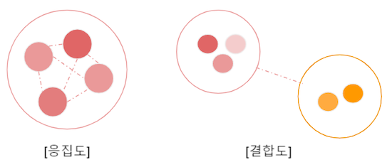
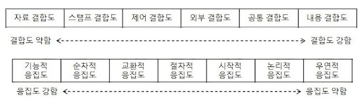
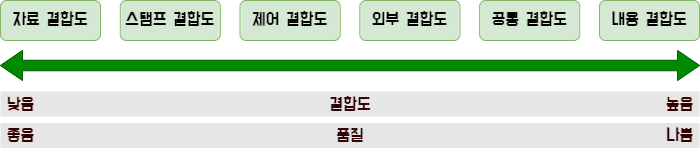
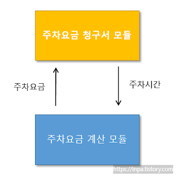
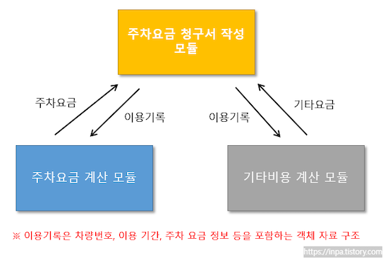
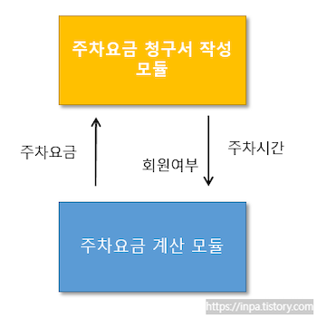
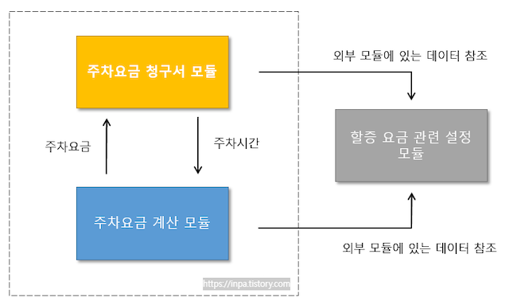
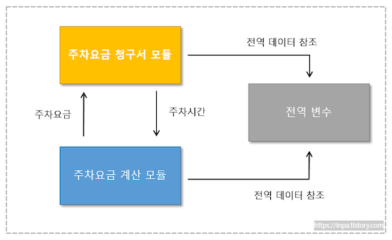
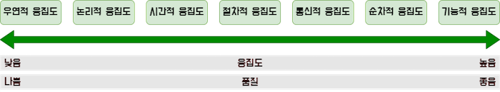

# 1. 소프트웨어의 모듈 독립성

프로그래밍이란 문제를 정의하고 하나씩 해결해나가는 과정을 말한다.

만약 문제가 복잡하고 큰 문제라면, 일반적으로 문제를 작은 부분으로 쪼개어서 하나씩 풀어나가게 될 것인데, 
이때 문제를 작은 부분으로 쪼개나가는 것을 `모듈화`라고 한다.

`모듈`은 **소프트웨어를 각 기능별로 나누어진 소스 단위**를 말한다. 
독립적으로 컴파일 가능한 프로그램 혹은 하나의 함수나 클래스도 모듈이 된다.

보통 **좋은 소프트웨어 일수록 모듈의 독립성이 높다**고 한다.
좋은 모듈화는 목적에 맞는 기능만으로 모듈을 나누게 되는데, 
각각의 모듈은 주어진 기능만을 독립적으로 수행하기 때문에 재사용성이 높고, 코드의 이해/수정이 용이하기 때문이다.

e.g. 해당 모듈을 수정하더라도 다른 모듈에 끼치는 영향이 적게 되며, 
오류가 발생하더라도, 기능 단위로 잘 나뉘어져 있기 때문에 손쉽게 문제를 발견해 해결할 수 있기도 한다.

이러한 모듈의 독립성은 모듈의 **결합도(Coupling)** 와 **응집도(Cohesion)**의 기준 단계 측정한다



* `결합도`는 **모듈과 모듈 간의 의존 정도**를 의미하고, 
* `응집도`는 **한 모듈 내의 구성요소들 간의 연관 정도**를 의미
  * 좋은 소프트웨어는 모듈 간 **결합도는 낮게, 응집도는 높게** 설계되어 있다.



그리고 결합도와 응집도의 **강도 세기에 따라 여러 단계**로 나뉘게 되는데 ,
응집도는 강할수록, 결합도는 느슨할 수록 독립성이 높은 모듈로 평가 된다.

> 💡 높은 응집도 & 낮은 결합도
>
> * 결합도가 높은 클래스의 문제점
>   * 클래스의 규모가 커지기 때문에 이해 하기 쉽지 않으며, 변화에 따른 다른 요소들의 변경을 예측하기 쉽지 않다.
> * 응집도 낮은 클래스의 문제점
>   * 코드를 이해하기가 힘들고, 재사용이 힘들다. 또한 유지보수가 매우 쉽지않으며 클래스 변화에 민감하다
>
> 따라서 **높은 응집도와 낮은 결합도**가 이상적인 소프트웨어 모듈이게 된다.
>
> 하지만 그렇다고 응집도는 높을수록 좋고 결합도는 낮을 수록 좋다는 
> "high cohesion loose coupling" 원칙이 항상 유효한 것은 아니다.
> 결국 프로그램의 특성이나 상황에 따라 유연하게 적용해야 한다.
>
> 하지만 시스템 유지보수 측면에 있어서 모듈의 응집도는 높을수록, 결합도는 낮을 수록 유리한 것은 분명하다.
> 특히나 남이 개발해놓은 엉망진창인 코드를 유지보수 해야할 때 비로소 체감하게 되는 것이 응집도와 결합도이다.
>
> 한번쯤은 들어본 객체지향의 여러가지 유명한 **디자인 패턴**들이 바로 이 응집도를 높히고 결합도를 낮추기 위한 원칙으로 설정되고 구성된 요소이다. 그래서 디자인 패턴의 원칙을 잘 지키면 하나하나 단계를 따질 필요없이 자연스럽게 "high cohesion loose coupling" 따르게 되니 다들 입을 모아 중요하다고 하는 것이다.

------

# 2. 결합도(Coupling)

결합도는 모듈(클래스 파일)간의 **상호 의존 정도** 또는 연관된 **관계의 끈끈함** 정도를 의미한다.

> e.g. 결합도가 높은 클래스? 
>
> * 다른 클래스와 연관 관계가 끈끈하다 →  하나의 클래스의 구조를 변경하면, 그에 연관된 클래스들도 싹 변경
> *  객체 사용 코드도 변경해야 할 수도 있어서, 유지보수 측면에서 매우 마이너스적임
>
> e.g. 실생활 예로 든 자동차
>
> * 완제품 자동차 하나에는 여러개의 모듈들 핸들, 바퀴, 엔진, 배터리 등이 들어있다.
> * 핸들과 바퀴 모듈간의 관계는 각각의 동작이 상호작용을 통해 자동차가 굴러가기 때문에 어느정도의 결합도가 생길 수 밖에 없다.
> * 하지만 그렇다고 해서 **바퀴를 교체하는데 핸들까지 교체**해야 된다면 이건 상식적으로 자동차 설계 부터가 잘못되었다.

------

##  2.1 결합도 단계 종류 : 내공외제스자

위에서 언급한 바와 같이 결합도는 강도와 세기에 따라 여러 단계로 종류별로 나뉘어 진다.
다음과 같이 결합도는 자료, 스탬프, 제어, 외부, 공통, 내용 결합도의 척도로 나타낼 수 있다.



|                종류                 | 내용                                                         |
| :---------------------------------: | ------------------------------------------------------------ |
|   자료 결합도<br/>(Data Coupling)   | 모듈간의 인터페이스로 전달되는 파라미터(**데이터**)를 통해서만 상호 작용이 일어나는 경우<br/>결합도가 제일 낮고 제일 좋은 형태이다. |
| 스탬프 결합도<br/>(Stamp Coupling)  | 모듈간의 인터페이스로 **배열이나 객체, 자료 구조 등이 전달**되는 경우 |
| 제어 결합도<br/>(Control Coupling)  | 어떤 모듈이 다른 모듈 내부의 **논리적인 흐름을 제어하는 제어 요소를 전달**하는 경우 |
| 외부 결합도<br/>(External Coupling) | 어떤 모듈이 외부에 있는 **다른 모듈의 데이터를 참조**하는 경우 (데이터, 통신 프로토콜 등) |
|  공통 결합도<br/>(Common Coupling)  | 여러 개의 모듈이 하나의 공통 데이터 영역(**전역 변수** 참조 및 갱신)을 사용하는 경우 |
| 내용 결합도<br/>(Content Coupling)  | 어떤 **모듈 내부에 있는 변수나 기능을 다른 모듈에서 사용**하는 경우<br/>결합도가 제일 높고 제일 좋지 않은 형태이다. |

------

### 2.1.1 자료 결합도 (Data Coupling) 



* 가장 결합도가 낮고, **가장 좋은 형태**
* 모듈끼리 **단순히 데이터**를 주고 받는 경우
  * (기능 수행에 있어서 로직을 제어하거나 하지 않는 순수한 자료형 요소의 데이터를 주고 받는 것)
* 한 모듈을 변경하더라도 다른 모듈에는 영향을 끼치지 않는 결합 형태

```js
// (1) 데이터 결합이 높은 예제=======================
function calculateTotalAndTax(price, taxRate) {
  const total = price + (price * taxRate);
  console.log(`Total: ${total}`);
}

calculateTotalAndTax(100, 0.1); // Total: 110

👇
// (2) 데이터 결합이 낮은 예제========================
function calculateTotalAndTax(price, taxRate) { 
  const total = price + (price * taxRate);
  console.log(`Total: ${total}`);
}

const priceValue = 100;
const taxRateValue = 0.1;

calculateTotalAndTax(priceValue, taxRateValue); // Total: 110
```

------

### 2.1.2 스탬프 결합도 (Stamp Coupling)



* 두 모듈이 인터페이스로 **배열이나 오브젝트와 같은 동일한 자료 구조**를 참조하는 형태의 결합도
* 만일 모듈에 쓰일 자료구조 형태가 변경되면 그것을 참조하는 모든 모듈에 영향을 주게 됨

```js
// 주문 생성 모듈
const orderCreator = {
  createOrder: (customerName, product, quantity) => {
    const order = {
      customerName,
      product,
      quantity,
    };
    orderProcessor.processOrder(order);
  },
};

// 주문 처리 모듈
const orderProcessor = {
  processOrder: (order) => {
    console.log(`Processing order for ${order.customerName}: ${order.quantity} ${order.product}`);
    // 주문 처리 로직
  },
};

orderCreator.createOrder('John Doe', 'Widget', 3);
```

------

### 2.1.3 제어 결합도 (Control Coupling)



* 어떤 모듈이 다른 모듈 내부의 **논리적인 흐름을 제어하는 제어 요소를 전달**하는 경우
* 상위 모듈이 하위 모듈의 상세한 처리 절차를 알고 있어 이를 통제하는 경우
* 제어 결합은 정보은닉을 위배하는 결합으로, 한 모듈이 다른 모듈 내부에 관여하여 관계가 복잡해짐

```js
// 컨트롤 결합이 있는 예제
function validateUser(username, password) {
  // 사용자 유효성 검사 로직
  if (username === 'admin' && password === 'password') return true;
  else  return false;
}

function login(username, password) {
  if (validateUser(username, password)) {
    console.log('로그인 성공');
    // 로그인 후 작업 수행
  } else {
    console.log('로그인 실패');
    // 로그인 실패 시 작업 수행
  }
}

login('admin', 'password');
```

------

### 2.1.4 외부 결합도 (External Coupling)



* 모듈이 **외부에 있는 다른 모듈의 데이터**를 참조할 때의 결합도
* 외부의 데이터, 통신 프로토콜 등을 공유할때 발생 (참조할 데이터가 외부 모듈에 위치할때)
* 어떤 외부 모듈에서 반환한 값을 다른 모듈에서 참조하는 경우
* 참조되는 데이터의 범위를 각 모듈에서 제한할 수 있다

```js
// 외부 결합이 있는 예제
const database = require('external-database-library');

function fetchUserData(userId) {
  // 외부 데이터베이스에 직접 접근
  const userData = database.fetchUser(userId);
  return userData;
}

const userId = 123;
const userData = fetchUserData(userId);

console.log(`User data: ${userData}`);
```

이 코드에서는 외부 DB에 직접 접근하고 있습니다.
`fetchUserData()`는 외부 DB 라이브러리를 직접 호출하고, 외부 DB에 대한 의존성을 가지고 있습니다.
만약 외부 DB의 구조가 변경되면 이 코드를 수정해야 합니다.
외부 결합을 최소화하려면 중간 계층을 도입하여 외부 시스템과의 상호작용을 캡슐화하고 추상화해야 합니다. 

------

### 2.1.5 공통 결합도 (Common Coupling)



- 여러 개의 모듈이 하나의 **공통 데이터 영역**을 사용하는 결합도
- 대표적으로 `전역 변수(global variable)`를 예로 들 수 있음 (전역 변수의 변경이 여러 모듈에 영향을 줌)
- 공통 데이터 영역의 내용을 조금만 변경하더라도 이를 사용하는 모든 모듈에 영향을 미침
- 위의 외부 결합도와 유사하게 볼수 있으나 공통 데이터가 외부냐 내부냐에 따라 차이가 있다. 
- 공통 결합도가 외부 결합도 보다 결합도가 높은 이유는, **전역 변수의 값에 따라 결국은 외부의 모듈 반환값 까지 결정**될 수 있는 가능성이 있기 때문에 외부 결합도 보다 더 결합도가 높도록 평가된다고 보면 된다.

```js
// 공통 결합이 있는 예제
// 모듈 1
const module1 = {
  data: [],
  
  addData: function(item) {
    this.data.push(item);
  },
};

// 모듈 2
const module2 = {
  processData: function() {
    for (const item of module1.data) {
      // 모듈 1의 데이터에 의존
      console.log(`Processing data: ${item}`);
    }
  },
};

module1.addData('Item 1');
module1.addData('Item 2');
module2.processData();
```

------

### 2.1.6 내용 결합도 (Content Coupling)

- 가장 높은 결합도를 갖으며, **가장 좋지 않은 결합 형태**
- 어떤 모듈이 사용하려면 **다른 모듈의 내부 기능과 데이터를 직접 참조해 그대로 가져와 사용하거나 수정**하는 경우
- 이렇게 되면 A모듈, B모듈 모두 코드를 알고 있어야 하며 A모듈이 변경되면 B모듈도 영향을 미쳐 변경해야 함

```js
// 컨텐츠 결합이 있는 예제
// 모듈 1
const module1 = {
  data: [1, 2, 3],
  
  // 모듈 2의 내부 데이터 구조에 직접 접근하여 변경
  modifyData: function() {
    module2.data.push(4);
  },
};

// 모듈 2
const module2 = {
  data: [4, 5, 6],
};

console.log('Before modification:');
console.log('Module 1 data:', module1.data);
console.log('Module 2 data:', module2.data);

// 모듈 1이 모듈 2의 데이터 구조를 변경
module1.modifyData();

console.log('After modification:');
console.log('Module 1 data:', module1.data);
console.log('Module 2 data:', module2.data);
```

------

# 3. 응집도(Cohesion)

`응집도`는 **하나의 클래스가 기능에 집중하기 위한 모든 정보와 역할을 갖고 있어야 한다**

정확히 응집도는 한 모듈 내의 구성 요소 간의 밀접한 정도를 의미하는데,
한 모듈이 하나의 기능(책임)을 갖고있는 것은 응집도가 높은 것이고,
한 모듈이 여러 기능을 갖고 있는 것은 응집도가 낮은 것이다. 

e.g. 쇼핑몰 프로젝트에서 주문 처리를 담당하는 클래스에서 회원의 정보를 업데이트하는 메서드가 있다면, 

* 이것은 응집도가 낮은 것이다.
* 회원 정보 업데이트는 회원만 담당하는 클래스에서 따로 분리하여 처리하는것이 옳기 때문이다.

## 3.1 응집도 단계 종류 : 우논시절 통순기



응집도의 강도 단계는 기능적, 순차적, 교환적, 절차적, 시간적, 논리적, 우연적 응집도의 척도로 분리 되며, 
이에 따라 모듈의 품질을 측정할 수 있다. 
기능적 응집도 쪽으로 갈 수록 좋은 품질이라고 할 수 있으며 우연적 응집도로 갈수록 나쁜 품질이 된다.

|                    종류                    | 내용                                                         |
| :----------------------------------------: | ------------------------------------------------------------ |
|  기능적 응집도<br/>(Functional Cohesion)   | **모듈 내부의 모든 기능이 단일 목적을 위해 수행되는 경우**<br/>응집도가 제일 높고 제일 좋은 형태이다. |
|  순차적 응집도<br/>(Sequential Cohesion)   | **모듈 내에서 한 활동으로부터 나온 출력 값을 다른 활동이 사용**할 경우 |
| 교환적 응집도<br/>(Communication Cohesion) | **동일한 입력과 출력을 사용해 다른 기능을 수행**하는 활동들이 모여있을 경우 |
|  절차적 응집도<br/>(Procedural Cohesion)   | 모듈이 다수 관련 기능을 가질 때, <br />**모듈 안의 구성요소들이 그 기능을 순차적으로 수행**할 경우 |
|   시간적 응집도<br/>(Temporal Cohesion)    | 연관된 기능이라기 보단 **특정 시간에 처리되어야 하는 활동들을 한 모듈에서 처리**할 경우 |
|    논리적 응집도<br/>(Logical Cohesion)    | 유사한 성격을 갖거나 **특정 형태로 분류되는 처리 요소들이 한 모듈에서 처리**되는 경우 |
| 우연적 응집도<br/>(Coincidental Cohesion)  | 모듈 내부의 **각 구성요소들이 연관이 없을 경우<br/>**응집도가 제일 낮고 제일 좋지 않은 형태이다. |

------

### 3.1.1 기능적 응집도 (Functional Cohesion) 

- 가장 응집도가 높은 형태로 가장 좋은 형태이다.
- **모듈 내부의 모든 기능이 단일 목적을 위해 수행**되는 경우
- 대입 되는 변수가 공통적으로 사용되는 경우
- 대표적인 예로 수학 연산에 관련된 모듈들을 모은 Math 클래스를 들 수 있다.

```js
// 기능 응집이 높은 예제
// 주문 관리 모듈
const orderManager = {
  orders: [],
  
  // 주문 추가
  addOrder: function(customerName, product, quantity) {
    const order = {
      customerName,
      product,
      quantity,
    };
    this.orders.push(order);
  },
  
  // 주문 목록 출력
  printOrders: function() {
    console.log('주문 목록:');
    for (const order of this.orders) {
      console.log(`${order.customerName}: ${order.quantity} ${order.product}`);
    }
  },
};

// 주문 추가
orderManager.addOrder('John Doe', 'Widget', 3);
orderManager.addOrder('Alice Smith', 'Gadget', 2);

// 주문 목록 출력
orderManager.printOrders();
```

------

### 3.1.2 순차적 응집도 (Sequential Cohesion) 

- 모듈 내에서 한 활동으로 부터 나온 출력값이 다음 활동의 입력 데이터로 사용할 경우
- 어떤 모듈이 특정 파일을 읽고 처리하는 기능을 하는 등과 같다

```js
// 순차 응집이 있는 예제
// 주문 처리 모듈
const orderProcessor = {
  processOrder: function(order) {
    console.log(`주문 처리 시작: ${order.orderNumber}`);
    this.validateOrder(order);
    this.calculateTotal(order);
    this.confirmOrder(order);
    console.log(`주문 처리 완료: ${order.orderNumber}`);
  },
  
  validateOrder: function(order) {
    console.log(`주문 유효성 검사: ${order.orderNumber}`);
    // 주문 유효성 검사 로직
  },
  
  calculateTotal: function(order) {
    console.log(`주문 금액 계산: ${order.orderNumber}`);
    // 주문 금액 계산 로직
  },
  
  confirmOrder: function(order) {
    console.log(`주문 확인: ${order.orderNumber}`);
    // 주문 확인 로직
  },
};

// 주문 데이터
const order1 = {
  orderNumber: '12345',
  // 다른 주문 정보들
};

const order2 = {
  orderNumber: '67890',
  // 다른 주문 정보들
};

// 주문 처리
orderProcessor.processOrder(order1);
orderProcessor.processOrder(order2);
```

------

### 3.1.3 교환적 응집도 (Communication Cohesion) 

- 통신적 응집도 라고도 불림
- 동일한 입력과 출력을 사용하여 다른 기능을 수행하는 활동들이 모여있는 경우
- 메소드 호출에 공통된 파라미터가 입력되는 경우
- 순차적 응집도와 차이점은 대신에 처리 순서가 중요치 않다는 것이다.

```js
// 통신 응집이 있는 예제

// 메시지 전송 모듈
const messageSender = {
  sendMessage: function(message, recipient) {
    console.log(`메시지 전송: "${message}" to ${recipient}`);
    // 메시지 전송 로직
  },
};

// 로그 모듈
const logger = {
  logMessage: function(message) {
    console.log(`로그: "${message}"`);
    // 로그 기록 로직
  },
};

// 알림 모듈
const notifier = {
  sendNotification: function(message, recipient) {
    console.log(`알림: "${message}" to ${recipient}`);
    // 알림 전송 로직
  },
};

// 메시지 전송
messageSender.sendMessage('안녕하세요!', 'John Doe');

// 로그 기록
logger.logMessage('사용자가 로그인했습니다.');

// 알림 전송
notifier.sendNotification('새 메시지가 도착했습니다.', 'Alice Smith');
```

------

### 3.1.4 절차적 응집도 (Procedural Cohesion) 

- 모듈이 다수 관련 기능을 가질 때 모듈 안의 구성요소가 그 기능을 순차적으로 수행할 경우
- 하나의 클래스에 있는 메소드들을 여러 개 호출하는 경우

```js
// 프로시저 응집이 있는 예제
// 주문 처리 모듈
function processOrder(order) {
  console.log(`주문 처리 시작: ${order.orderNumber}`);
  validateOrder(order);
  calculateTotal(order);
  confirmOrder(order);
  console.log(`주문 처리 완료: ${order.orderNumber}`);
}

function validateOrder(order) {
  console.log(`주문 유효성 검사: ${order.orderNumber}`);
  // 주문 유효성 검사 로직
}

function calculateTotal(order) {
  console.log(`주문 금액 계산: ${order.orderNumber}`);
  // 주문 금액 계산 로직
}

function confirmOrder(order) {
  console.log(`주문 확인: ${order.orderNumber}`);
  // 주문 확인 로직
}

// 주문 데이터
const order1 = {
  orderNumber: '12345',
  // 다른 주문 정보들
};

const order2 = {
  orderNumber: '67890',
  // 다른 주문 정보들
};

// 주문 처리
processOrder(order1);
processOrder(order2);
```

------

### 3.1.5 시간적 응집도 (Temporal Cohesion) 

- 일시적 응집도 라고도 불림
- 각 기능 요소들이 순서에 상관없이 특정 시점에 반드시 수행되는 경우
- 연관된 기능이라기 보단 특정 시간에 처리되어야 하는 활동들을 한 모듈에서 처리할 경우
- 메소드 호출이 일어나지 않고 **변수의 초기화**만 실행되거나, Exception **에러 로그**를 보내거나 등

```js
// 시간 응집이 있는 예제

// 주문 처리 모듈
const orderProcessor = {
  processOrder: function(order) {
    console.log(`주문 처리 시작: ${order.orderNumber}`);
    // 주문 처리 작업
    this.logOrderProcessingTime();
  },
  
  logOrderProcessingTime: function() {
    console.log('주문 처리 시간 기록');
    // 주문 처리 시간 기록 작업
  },
};

// 주문 데이터
const order1 = {
  orderNumber: '12345',
  // 다른 주문 정보들
};

const order2 = {
  orderNumber: '67890',
  // 다른 주문 정보들
};

// 주문 처리
orderProcessor.processOrder(order1);
orderProcessor.processOrder(order2);
```

------

### 3.1.6 논리적 응집도 (Logical Cohesion) 

- 유사한 성격을 갖거나 특정 형태로 분류되는 처리 요소들이 한 모듈에서 처리되는 경우
- 논리적으로 비슷한 기능을 수행하지만 서로의 관계는 밀접하지 않은 형태
- switch문이 쓰여 case에 따라 비슷하지만 다른 작업을 수행하는 경우

```js
// 논리 응집이 있는 예제

// 주문 관리 모듈
const orderManager = {
  orders: [],
  
  // 주문 추가
  addOrder: function(order) {
    this.orders.push(order);
  },
  
  // 주문 유효성 검사
  validateOrder: function(order) {
    if (order.quantity > 0 && order.customerName) {
      return true;
    }
    return false;
  },
  
  // 주문 처리
  processOrder: function(order) {
    if (this.validateOrder(order)) {
      console.log(`주문 처리: ${order.customerName} 주문`);
      // 주문 처리 로직
    } else {
      console.log('주문 유효성 검사 실패');
    }
  },
};

// 주문 데이터
const order1 = {
  customerName: 'John Doe',
  quantity: 3,
  // 다른 주문 정보들
};

const order2 = {
  customerName: 'Alice Smith',
  quantity: -1,
  // 다른 주문 정보들
};

// 주문 추가 및 처리
orderManager.addOrder(order1);
orderManager.processOrder(order1);

orderManager.addOrder(order2);
orderManager.processOrder(order2);
```

------

### 3.1.7 우연적 응집도 (Coincidental Cohesion)

- 가장 좋지 않은 응집도
- 모듈 내부의 각 구성 요소들이 서로 관련없는 요소로만 구성된 경우

```js
// 동업 응집이 있는 예제
// 주문 관리 모듈
const orderManager = {
  orders: [],
  
  // 주문 추가
  addOrder: function(order) {
    this.orders.push(order);
  },
  
  // 사용자 인증
  authenticateUser: function(username, password) {
    // 사용자 인증 로직
  },
  
  // 화폐 변환
  convertCurrency: function(amount, fromCurrency, toCurrency) {
    // 화폐 변환 로직
  },
  
  // 날씨 정보 가져오기
  getWeather: function(city) {
    // 날씨 정보 API 호출
  },
};

// 주문 데이터
const order1 = {
  customerName: 'John Doe',
  quantity: 3,
  // 다른 주문 정보들
};

// 사용자 인증
orderManager.authenticateUser('username', 'password');

// 화폐 변환
orderManager.convertCurrency(100, 'USD', 'EUR');

// 날씨 정보 가져오기
orderManager.getWeather('New York');
```

