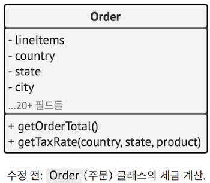
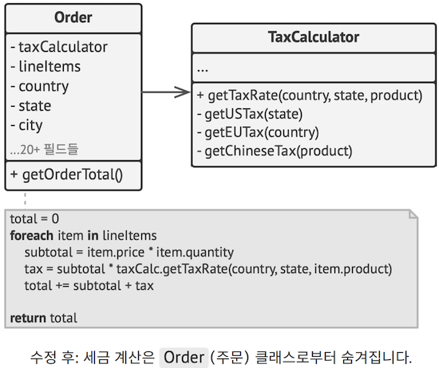
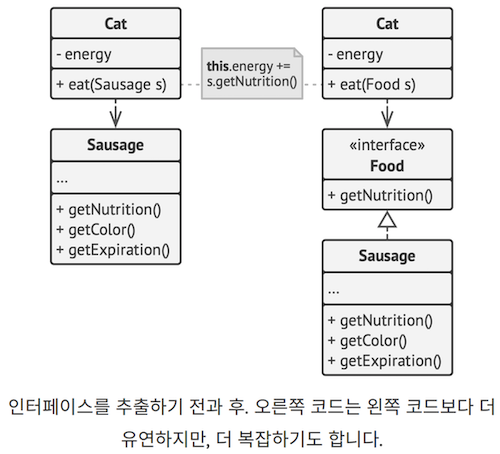
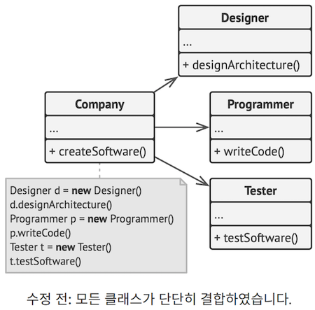
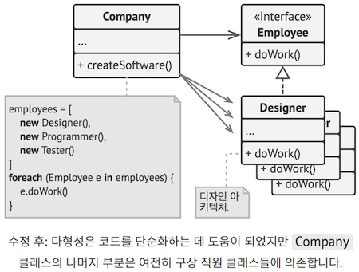
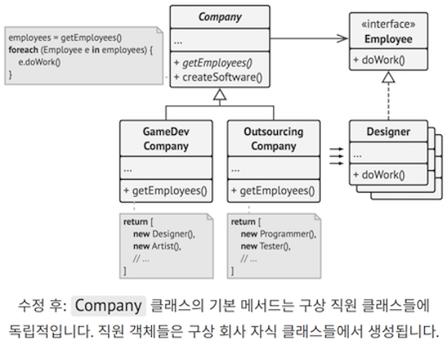
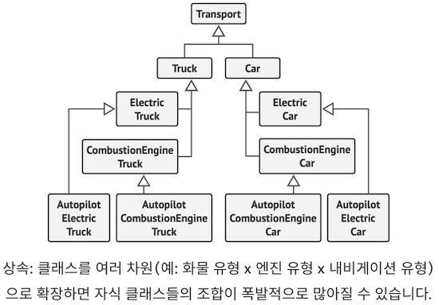
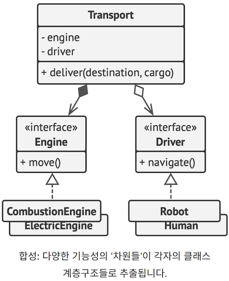

좋은 소프트웨어 디자인이란 무엇일까요? 그리고 그건 어떻게 측정할까요?
또 이를 달성하기 위해서는 어떤 관행을 따라야 할까요?
아키텍처를 유연하고 안정적이며 이해하기 쉽게 만드는 방법은 무엇일까요?

훌륭한 질문들이나 불행히도 정답은 개발 중인 앱의 유형에 따라 다릅니다.
그래도 소프트웨어 설계에는 몇 가지 보편적인 원칙들이 있으며,
이러한 원칙들이 당신의 프로젝트에 대한 위 질문들에 답하는 데 도움이 될 수 있습니다.
이 책에 나열된 대부분의 디자인 패턴들은 이러한 원칙들을 기반으로 합니다.

---

# 1. 변화하는 내용을 캡슐화하기

> 당신의 앱에서 변경되는 부분들을 식별한 후 변하지 않는 부분들과 구분하세요.

이 원칙의 가장 큰 목적은 변화로 인해 발생하는 결과를 최소화하는 것입니다.

당신의 앱이 선박이고 변경 사항들은 물속에 대기하고 있는 끔찍한 지뢰들이라고 상상해 보세요.
지뢰에 걸리면 선박은 가라앉습니다.

이 사실을 알기에 당신은 선박의 선체를 독립된 구획으로 나눌 수 있습니다.
그러면 선박이 지뢰에 부딪쳐도 구획 하나만 안전하게 봉쇄하면 선박 전체는 여전히 떠 있게 됩니다

동일한 방식으로 당신은 독립된 모듈에서 변경되는 프로그램의 일부를 따로 떼어내어
코드의 나머지 부분들을 역효과로부터 보호할 수 있습니다.
그렇게 하면 프로그램을 다시 작동하는 상태로 만들고,
변경 사항들을 구현하고 테스트하는 데 걸리는 시간을 줄일 수 있습니다.
변경 사항을 적용하는 데 드는 시간이 줄어들수록, 기능을 구현하는 데 더 많은 시간을 쓸 수 있을 것입니다.

---

## 1.1 메서드 수준에서의 캡슐화

당신이 전자 상거래 웹사이트를 개발하고 있다고 가정해 봅시다.
코드 어딘가에 세금을 포함한 주문의 총계를 계산하는 getOrderTotal 메서드가 있습니다.

우리는 앞으로 세금 관련 코드를 변경해야 할지도 모른다는 사실을 예측할 수 있습니다.
왜냐하면 세율은 당신이 거주하는 국가, 주, 도시에 따라 다르고, 시간이 흘러 새로운 법률이나 규정이 나와 실제 공식을 변경해야 할 수도 있기 때문입니다. 그러면 getOrderTotal 메서드를 아주 자주 변경해야 할 수도 있습니다.
그러나 이 메서드의 이름에서도 알 수 있듯이 해당 메서드는 세금이 계산되는 방법에는 아무 관심이 없습니다.

```js
method getOrderTotal(order) is
	total = 0
	foreach item in order.lineItems
		total += item.price * item.quantity

if (order.country == "US")
	total += total * 0.07 // US sales tax
else if (order.country == "EU"):
	total += total * 0.20 // European VAT

return total
```

수정 전: 세금 계산 코드가 메서드의 나머지 코드와 뒤섞여 있습니다.

당신은 이제 세금 계산 로직을 별도의 메서드로 추출하여 원래 메서드로부터 숨길 수 있습니다.

```js
method getOrderTotal(order) is
	total = 0
	foreach item in order.lineItems
		total += item.price * item.quantity

	total += total * getTaxRate(order.country)

	return total

method getTaxRate(country) is
	if (country == "US")
		return 0.07 // US sales tax
	else if (country == "EU")
		return 0.20 // European VAT
	else
		return 0
```

수정 후: 지정된 메서드를 호출함으로써 세율을 구할 수 있습니다

이제 세금 관련 변경 사항들은 단일 메서드 내에서 격리됩니다.
또 세금 계산 로직이 너무 복잡해지면 그것을 별도의 클래스로 옮기기도 쉬워졌습니다.

---

## 1.2 클래스 수준에서의 캡슐화

시간이 흐르면서 이전에는 간단한 작업을 수행했던 메서드에 점점 더 많은 책임이 추가될 수 있습니다.
이렇게 추가된 행동들은 고유의 도우미 필드와 메서드를 동반하곤 하는데,
이는 결국 이 모든 것을 포함하는 클래스의 기본적인 책임을 모호하게 만듭니다.
이 모든 것들을 새 클래스로 추출하면 코드는 훨씬 명확하고 간단해집니다.



Order 클래스의 객체들이 모든 세금 관련 작업을 해당 작업만 수행하는 특수 객체에 위임합니다



---

# 2. 구현이 아닌 인터페이스에 대해 프로그래밍하기

> 구현이 아닌 인터페이스에 대해 프로그래밍하세요. 또 구상 클래스에 의존하는 대신 추상화에 의존하세요.

기존의 코드를 망가뜨리지 않고 쉽게 확장할 수 있다면 그 디자인은 충분히 유연하다고 말할 수 있습니다.
다른 고양이 예시를 하나 살펴보면서 이 말이 맞는지 확인해 보도록 하죠.
어떤 음식이든 먹을 수 있는 Cat (고양이)는 소시지만 먹을 수 있는 고양이보다 유연합니다.
소시지는 '어떤 음식'의 부분 집합이기 때문에 첫 번째 고양이에게 먹일 수 있습니다.
한편 그 고양이의 식사 메뉴는 그 어떤 음식으로도 확장할 수 있죠.

만약 두 클래스가 서로 같이 작업하도록 만들려면 둘 중 하나를 다른 클래스에 의존하게 만드는 것으로 시작할 수 있습니다.
저도 가끔 이 방식으로 시작합니다. 그런데 객체 간의 공동 작업을 만드는 더 유연한 방법이 하나 더 있습니다.

1. 한 객체가 다른 객체에서 정확히 무엇을 필요로 하는지 확인하세요. 어떤 메서드들을 실행하나요?
2. 새 인터페이스 또는 추상 클래스에서 이러한 메서드들을 설명하세요.
3. 다른 객체에 의존하는(dependency인) 클래스가 이 인터페이스를 구현하도록 하세요.
4. 이제 두 번째 클래스를 구상 클래스가 아닌 이 인터페이스에 의존하도록 하세요.
   여전히 원래 클래스의 객체들과 작동하도록 만들 수 있지만 이제 연결이 훨씬 더 유연합니다



이렇게 변경한 뒤 바로 좋아졌다고 느끼지 못할지도 모릅니다. 좋아지긴커녕 코드는 전보다 복잡해졌죠.
하지만 기능을 좀 더 넣을 수 있는 좋은 확장 포인트가 될 수 있겠다고 느껴지거나,
이 코드를 사용하는 다른 사람들이 여기서 뭔가 확장하고 싶어 할 거란 느낌이 든다면 변경을 수행하세요.

---

## 2.1 예시

이 예시는 객체의 구상 클래스에 의존하는 것보다 그들의 인터페이스를 통해 작업하는 것이 더 유익할 수 있음을 보여줍니다.
당신이 소프트웨어 개발 회사 시뮬레이터를 개발하고 있다고 가정해 봅시다.
그 시뮬레이터에는 여러 직원 유형들을 나타내는 다양한 클래스들이 있을 것입니다.



처음에는 Company (회사) 클래스가 직원들의 구상 클래스들과 밀접하게 결합되어 있습니다.
한편, 두 클래스의 구현의 차이에도 불구하고,
우리는 다양한 업무 관련 메서드들을 일반화한 다음 모든 직원 클래스들에 대한 공통 인터페이스를 추출할 수 있습니다.

그런 다음 Company 클래스 내부에 다형성을 적용하여,
Employee (직원) 인터페이스를 통해 다양한 직원 객체들을 처리할 수 있습니다.



Company 클래스는 여전히 직원 클래스에 연결되어 있습니다. 이건 좋은 게 아닙니다.
왜냐하면 다른 유형의 직원과 함께 일하는 새로운 유형의 회사들을 소개하려면,
Company 클래스의 코드를 재사용하는 대신 이 클래스의 대부분을 오버라이드해야 하기 때문입니다.

이 문제를 해결하기 위해 직원들을 가져오는 메서드를 abstract로 선언할 수 있습니다.
각 구상 회사는 이 메서드를 다르게 구현할 것이며, 자기 회사에 필요한 직원들만 만들 것입니다.



이렇게 변경한 후 Company 클래스는 다양한 직원 클래스에서 독립되었습니다.
이제 기초 회사 클래스의 일부를 계속 재사용하면서 이 클래스를 확장하여 새로운 유형들의 회사들과 직원들을 소개할 수 있습니다.
기초 회사 클래스를 확장해도 이미 그에 의존하고 있는 기존 코드는 손상되지 않습니다.

그건 그렇고, 방금 디자인 패턴이 실제로 어떻게 적용되는지 보셨습니다!
앞에서 나온 내용이 바로 팩토리 메서드 패턴의 예시였습니다. 걱정 마세요. 나중에 이 패턴에 대해 자세히 설명하겠습니다.

---

# 3. 상속보다 합성을 사용하기

클래스들 사이에서 코드를 재사용하는 가장 확실하고 쉬운 방법은 아마도 상속일 겁니다.
e.g. 같은 코드를 가진 두 개의 클래스가 있다고 가정해 봅시다.
이 두 클래스에 대한 공통 기초 클래스를 만든 후 유사한 코드를 거기로 이동하는 거죠. 누워서 떡 먹기네요!

하지만 상속에는 주의할 점이 있습니다.
이러한 문제들은 프로그램에 이미 엄청나게 많은 클래스가 포함되어 뭔가를 변경하는 것이 상당히 어려워진 뒤에야 확실해지곤 합니다.
다음은 그런 문제들의 목록입니다.

- **자식 클래스는 상위 클래스의 인터페이스를 줄일 수 없습니다.**
  - 자식 클래스는 비록 사용하지 않더라도 부모 클래스의 모든 추상 메서드들을 구현해야 합니다.
- **메서드들을 오버라이드할 때 새 행동이 기초 행동과 호환되는지 확인해야 합니다.**
  - 이것이 중요한 이유는 자식 클래스의 객체들이 부모 클래스의 객체들을 예상하는 모든 코드에 전달될 수 있으며,
    코드가 호환되지 않아 충돌하면 안 되기 때문입니다.
- **상속은 부모 클래스의 캡슐화를 깨뜨립니다.**
  - 왜냐하면 부모 클래스 내부의 세부 정보들을 자식 클래스에서 사용할 수 있기 때문입니다.
  - 이와는 반대 상황이 있을 수도 있습니다.
  - 개발자가 추가 확장을 더 쉽게 만들기 위해
    상위 클래스가 자식 클래스들의 일부 세부 사항들을 인식하도록 설계할 수도 있겠죠
- **자식 클래스들은 부모 클래스들과 밀접하게 결합합니다.**
  - 부모 클래스를 변경하면 자식 클래스들의 기능들이 손상될 수 있습니다.
- **상속을 통해 코드를 재사용하려고 하면 병렬 상속 계층구조들이 생성될 수 있습니다.**
  - 상속은 일반적으로 단일 차원에서 발생합니다.
  - 그러나 차원이 두 개 이상이면 그때마다 많은 클래스 조합들을 만들어야 합니다.
  - 그러면 클래스 계층구조는 말도 안 되는 크기로 부풀려질 수 있습니다

상속에는 `합성`이라는 대안이 있습니다. 상속은 클래스 간의 '나는 무엇의 ~이다'라는 관계를 나타내지만, (예: 자동차는 교통수단이다 ), 합성은 '~을/를 가진다' 관계들(예: 자동차는 엔진을 가진다)을 나타냅니다

이 원칙은 집합관계에도 적용될 수 있습니다. 집합관계는 합성의 더욱 완화된 변형으로,
여기서는 한 객체가 다른 객체에 대한 참조를 가질 수는 있지만 이 객체의 수명주기는 관리하지 않습니다.
예를 들어, 자동차는 운전자를 가집니다. 그러나 운전자는 차를 사용하지 않거나, 차 없이(가진다의 반대) 그냥 걷을 수도 있습니다

---

## 3.1 예시

자동차 제조업체를 위한 카탈로그 앱을 만들어야 한다고 가정해 보세요. 이 회사는 자동차와 트럭을 모두 만듭니다.
차량은 전기 차나 가스 차가 될 수 있습니다. 그리고 모든 모델은 수동 운전 장치나 자동 운전 장치를 가질 수 있습니다



보시다시피 각 추가 매개변수는 자식 클래스들의 수를 증가시킵니다.
또 자식 클래스는 동시에 두 개의 클래스를 확장할 수 없으므로 자식 클래스 간에 중복 코드가 많이 있을 것입니다.

이러한 문제들은 합성으로 해결할 수 있습니다.
자동차 객체들이 자체적으로 행동을 구현하게 하는 대신 다른 객체들에 이를 위임할 수 있습니다.

또 이점이 하나 더 추가되었는데 이는 런타임 때 행동을 바꿀 수 있다는 점입니다.
e.g. 자동차에 다른 엔진 객체를 할당하여 자동차 객체에 연결된 엔진 객체를 교체할 수 있습니다.



이 클래스 구조는 이 책의 뒷부분에서 다룰 전략 패턴과 유사합니다.
