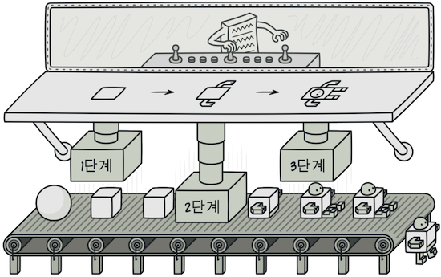
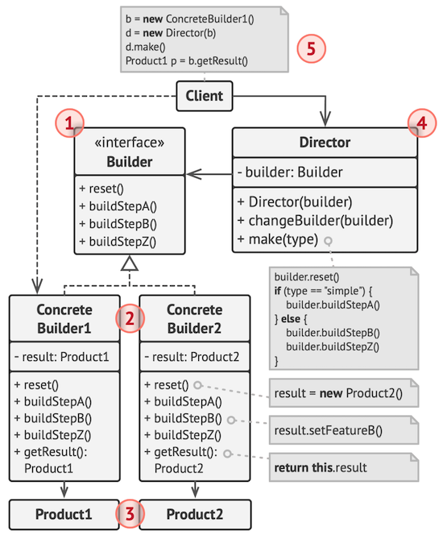
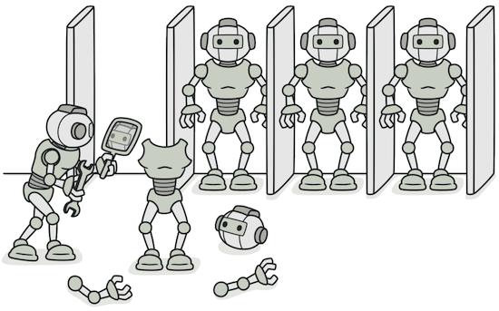
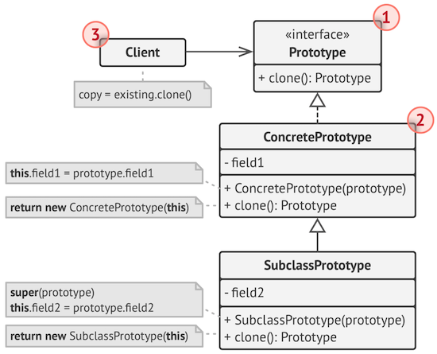
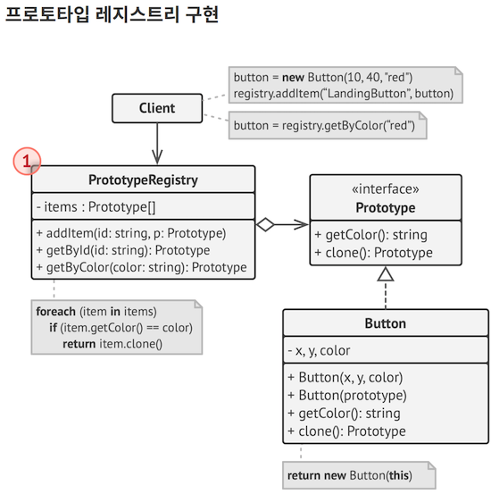
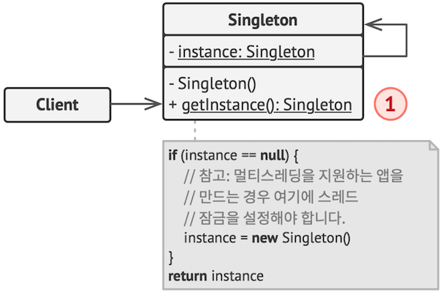

생성 디자인 패턴은 기존 코드의 유연성과 재사용을 증가시키는 객체를 생성하는 다양한 방법을 제공합니다.

---

# 1. 팩토리 메서드 (Factory Method)

* 객체 생성을 `공장(Factory) 클래스`로 캡슐화 처리하여 대신 생성하게 하는 생성 디자인 패턴
  * `부모 클래스`에서 **객체들을 생성할 수 있는 인터페이스를 제공**하지만,
  * `자식 클래스들`이 **생성될 객체들의 유형을 변경할 수 있도록** 하는 생성 패턴
* 즉, 클라이언트에서 직접 `new 연산자`를 통해 제품 객체를 생성하는 것이 아닌, 
  * 제품 객체들을 도맡아 생성하는 공장 클래스를 만들고, 
  * 이를 상속하는 서브 공장 클래스의 메서드에서 여러가지 제품 객체 생성을 각각 책임지는 것이다
* 또한 객체 생성에 필요한 과정을 템플릿 처럼 미리 구성해놓고, 
  * 객체 생성에 관한 전처리나 후처리를 통해 생성 과정을 다양하게 처리하여, 
  * 객체를 유연하게 정할 수 있는 특징도 있다

------

## 1.1 구조

1. `Creator` : 최상위 공장 클래스로서, 팩토리 메서드를 추상화하여 서브 클래스로 하여금 구현하도로 함
   - `객체 생성 처리 메서드(someOperartion)` : 객체 생성에 관한 전처리, 후처리를 템플릿화한 메소드
   - `팩토리 메서드(createProduct)` : 서브 공장 클래스에서 재정의할 객체 생성 추상 메서드
2. `ConcreteCreator` : 각 서브 공장 클래스들은 이에 맞는 제품 객체를 반환하도록 생성 추상 메소드를 재정의한다. 
   - 즉, 제품 객체 하나당 그에 걸맞는 생산 공장 객체가 위치된다.
3. `Product` : 제품 구현체를 추상화
4. `ConcreteProduct` : 제품 구현체

> 💡 정리하면,
>
> `팩토리 메소드 패턴`은 `객체를 만들어내는 공장(Factory 객체)을 만드는 패턴`이라고 보면 된다. 
>그리고 어떤 클래스의 인스턴스를 만들지는 미리 정의한 공장 서브 클래스에서 결정한다.

------

## 1.2 적용 시기

* 클래스 생성과 사용의 처리 로직을 분리하여 결합도를 낮추고자 할 때
* 코드가 동작해야 하는 객체의 유형과 종속성을 캡슐화를 통해 정보 은닉 처리 할 경우
* 라이브러리 혹은 프레임워크 사용자에게 구성 요소를 확장하는 방법을 제공하려는 경우 
* 기존 객체를 재구성하는 대신 기존 객체를 재사용하여 리소스를 절약하고자 하는 경우
  - 상황에 따라 적절한 객체를 생성하는 코드는 자주 중복될 수 있다. 그리고 객체 생성 방식의 변화는 해당되는 모든 코드 부분을 변경해야 하는 문제가 발생한다. 
  - 따라서 객체의 생성 코드를 별도의 클래스 / 메서드로 분리 함으로써 객체 생성의 변화에 대해 대비를 하기 위해 팩토리 메서드 패턴을 이용한다고 보면 된다. 
  - 특정 기능의 구현은 별개의 클래스로 제공되는 것이 바람직한 설계이기 때문이다.

------

## 1.3 패턴 장점

- 생성자(Creator)와 구현 객체(concrete product)의 강한 결합을 피할 수 있다.
- 팩토리 메서드를 통해 객체의 생성 후 공통으로 할 일을 수행하도록 지정해줄 수 있다.
- 캡슐화, 추상화를 통해 생성되는 객체의 구체적인 타입을 감출 수 있다.
- [단일 책임 원칙Visit Website](https://inpa.tistory.com/entry/OOP-💠-아주-쉽게-이해하는-SRP-단일-책임-원칙) 준수 : 객체 생성 코드를 한 곳 (패키지, 클래스 등)으로 이동하여 코드를 유지보수하기 쉽게 할수 있으므로 원칙을 만족
- [개방/폐쇄 원칙Visit Website](https://inpa.tistory.com/entry/OOP-💠-아주-쉽게-이해하는-OCP-개방-폐쇄-원칙) 준수 : 기존 코드를 수정하지 않고 새로운 유형의 제품 인스턴스를 프로그램에 도입할 수 있어 원칙을 만족 (확장성 있는 전체 프로젝트 구성이 가능)
- 생성에 대한 인터페이스 부분과 생성에 대한 구현 부분을 따로 나뉘었기 때문에 패키지 분리하여 개별로 여러 개발자가 협업을 통해 개발

------

## 1.4 패턴 단점

* 각 제품 구현체마다 팩토리 객체들을 모두 구현해야 되기 때문에, 
  구현체가 늘어날때 마다 팩토리 클래스가 증가하여 서브 클래스 수가 폭발한다.
* 코드의 복잡성이 증가한다.

---

# 2. 추상 팩토리 (Abstract Factory)

추상 팩토리는 **관련 객체들의 구상 클래스들을 지정하지 않고도**,
관련 **객체들의 모음을 생성할 수 있도록** 하는 생성패턴입니다.

e.g. 모니터, 마우스, 키보드를 묶은 전자 제품군을 또 삼성 제품군이냐 애플 제품군이냐 따라 집합이 브랜드 명으로 여러갈래로 나뉘게 될때, 복잡하게 묶이는 이러한 제품군들을 관리와 확장하기 용이하게 패턴화 한것이 추상 팩토리

------

## 2.1 구조

1. `AbstractFactory` : 최상위 공장 클래스. 여러개의 제품들을 생성하는 여러 메소드들을 추상화 한다.
2. `ConcreteFactory` : 서브 공장 클래스들은 타입에 맞는 제품 객체를 반환하도록 메소드들을 재정의한다.
3. `AbstractProduct` : 각 타입의 제품들을 추상화한 인터페이스
4. `ConcreteProduct` (ProductA ~ ProductB) : 각 타입의 제품 구현체들. 이들은 팩토리 객체로부터 생성된다. 
5. `Client` : Client는 추상화된 인터페이스만을 이용하여 제품을 받기 때문에, 구체적인 제품, 공장에 대해서는 모른다.

------

## 2.2 적용 시기

- 관련 제품의 다양한 제품 군과 함께 작동해야 할때, 해당 제품의 구체적인 클래스에 의존하고 싶지 않은 경우
- 여러 제품군 중 하나를 선택해서 시스템을 설정해야하고 한 번 구성한 제품을 다른 것으로 대체할 수도 있을 때
- 제품에 대한 클래스 라이브러리를 제공하고, 그들의 구현이 아닌 인터페이스를 노출시키고 싶을 때

------

## 2.3 장점

- 객체를 생성하는 코드를 분리하여 클라이언트 코드와 결합도를 낮출 수 있다.
- 제품 군을 쉽게 대체 할 수 있다.
- [단일 책임 원칙 준수Visit Website](https://inpa.tistory.com/entry/OOP-💠-아주-쉽게-이해하는-SRP-단일-책임-원칙)
- [개방 / 폐쇄 원칙 준수Visit Website](https://inpa.tistory.com/entry/OOP-💠-아주-쉽게-이해하는-SRP-단일-책임-원칙)

------

## 2.4 단점

- 각 구현체마다 팩토리 객체들을 모두 구현해주어야 하기 때문에 객체가 늘어날때 마다 클래스가 증가하여 코드의 복잡성이 증가한다. (팩토리 패턴의 공통적인 문제점)
- 기존 추상 팩토리의 세부사항이 변경되면 모든 팩토리에 대한 수정이 필요해진다. 이는 추상 팩토리와 모든 서브클래스의 수정을 가져온다. 
- 새로운 종류의 제품을 지원하는 것이 어렵다. 새로운 제품이 추가되면 팩토리 구현 로직 자체를 변경해야한다.

> 💡 정리하면,
>
> `추상 팩토리`는 관련된 객체 그룹을 생성하고 클라이언트가 어떤 구체적인 객체를 사용할지 알 필요가 없도록 합니다.

------

## 2.5 팩토리 메서드 vs 추상 팩토리

### 2.5.1 목적

- `팩토리 메서드` : **하위 클래스에서 클래스 인스턴스를 생성하도록 하는 것**
- `추상 팩토리` : **여러 객체들의 패밀리를 생성**하고 **이들을 조합하여 전체 시스템을 구축**하는 것

### 2.5.2 사용법

1. `팩토리 메서드`: 
   - 클래스에서 **구체적인 객체 생성을 처리하기 위해 팩토리 메서드를 제공**
   - 이 메서드는 하위 클래스에서 오버라이드하여 실제 객체 생성을 수행
   - 단일 메서드를 사용하여 객체를 생성하고, 하위 클래스에서 이 메서드를 오버라이드하여 적절한 객체를 생성
2. `추상 팩토리` : 
   - 관련된 **객체 패밀리를 생성하는 인터페이스를 정의**하고, 이 **인터페이스를 구현하는 여러 팩토리 클래스를 제공**
   - 각 팩토리 클래스는 특정 객체 패밀리를 생성하는 데 필요한 모든 객체를 생성
   - 클라이언트는 원하는 팩토리를 선택하고 해당 팩토리를 사용하여 객체를 생성

### 2.5.3 예시

1. `팩토리 메서드`: 
   - 웹 페이지를 생성하는 웹 사이트 디자인 프레임워크가 있다고 가정
   - 웹 페이지를 생성하는 팩토리 메서드를 하위 클래스에서 오버라이드하여 특정 유형의 웹 페이지를 생성
2. `추상 팩토리` : 
   - iOS와 Android용 버전 앱을 동시에 개발해야 할 때, 
   - 각 플랫폼에 대한 위젯, 버튼, 대화 상자 등을 생성하기 위한 추상 팩토리를 사용

---

# 3. 빌더 (Builder) 

* **복잡한 객체들을 단계별로 생성할 수 있도록** 하는 생성 디자인 패턴
  * 즉, 복잡한 객체의 생성 과정과 표현 방법을 분리하여 다양한 구성의 인스턴스를 만드는 생성 패턴
  * **생성자에 들어갈 매개 변수를 메서드로 하나하나 받아들이고 마지막에 통합 빌드해서 객체를 생성**하는 방식
  * 이 패턴을 사용하면, 같은 제작 코드를 사용하여 객체의 다양한 유형들과 표현을 제작
* e.g. 햄버거를 주문할때 빵이나 패티 등 속재료들은 주문하는 사람이 마음대로 결정하는 (서브웨이 샌드위치점)
  * 어느 사람은 치즈를 빼달라고 할수 있고 어느 사람은 토마토를 빼달라고 할수 있다.
  * 이처럼 선택적 속재료들을 보다 유연하게 받아 다양한 타입의 인스턴스를 생성할수 있어,
  * 클래스의 선택적 매개변수가 많은 상황에서 유용하게 사용된다.

------

## 3.1 구조

1. `Builder 인터페이스` : 모든 유형의 Builder들에 공통적인 Product 생성 단계들을 선언
2. `Concreate Builder` : 생성 단계들의 다양한 구현을 제공합니다. 
   - 또 Concreate Builder들은 공통 인터페이스를 따르지 않는 제품들도 생산할 수 있습니다.
3. `Product`  : Concreate Builder의 결과로 나온 객체들
   - 다른 Builder에 의해 생던된 Product는 같은 클래스 계층구조 또는 인터페이스에 속할 필요가 없음
4. `Director 클래스` : 생성 단계들을 호출하는 순서를 정의하므로 제품들의 특정 설정을 만들고 재사용할 수 있습니다.
5. `Client` : Builder 객체들 중 하나를 `Director 클래스`와 연결해야 합니다.
   - 일반적으로 위 연결은 Director 생성자의 매개변수들을 통해 한 번만 수행되며,
   - 그 후 Director는 모든 추가 생성에 해당 Builder 객체들을 사용합니다.
   - 그러나 Client가 Builder 객체를 디렉터의 프로덕션 메서드에 전달할 때를 위한 대안적 접근 방식이 있습니다.
   - 이 경우 Director와 함께 무언가를 만들 때마다 다른 Builder를 사용할 수 있습니다.

------

## 3.2 장점

* 객체들을 단계별로 생성하거나 생성 단계들을 연기하거나 재귀적으로 단계들을 실행할 수 있습니다
* 제품들의 다양한 표현을 만들 때 같은 생성 코드를 재사용할 수 있습니다.
* 단일 책임 원칙. 제품의 비즈니스 로직에서 복잡한 생성 코드를 고립시킬 수 있습니다.

------

## 3.3 단점

* 패턴이 여러 개의 새 클래스들을 생성해야 하므로, **코드의 전반적인 복잡성이 증가**합니다.

------

## 3.4 다른 패턴과의 관계

* 많은 디자인은 복잡성이 낮고 자식 클래스들을 통해 더 많은 커스터마이징이 가능한 **팩토리 메서드**로 시작해,
  * 더 유연하면서도 더 복잡한 **추상 팩토리, 프로토타입 또는 빌더 패턴으로 발전**해 나갑니다.
* `빌더`는 **복잡한 객체들을 단계별로 생성하는 데 중점**을 둡니다. 
  * `추상 팩토리`는 **관련된 객체들의 패밀리들을 생성하는 데 중점**을 둡니다.
  * `추상 팩토리`는 **제품을 즉시 반환**하지만, 
  * `빌더`는 **제품을 가져오기 전에 당신이 몇 가지 추가 생성 단계들을 실행**할 수 있도록 합니다.
* 당신은 복잡한 **복합체 패턴 트리를 생성할 때 빌더를 사용**할 수 있습니다. 
  * 왜냐하면 빌더의 생성 단계들을 재귀적으로 작동하도록 프로그래밍할 수 있기 때문입니다.
* **빌더를 브리지와 조합할 수 있습니다**. 
  * 디렉터 클래스는 추상화의 역할을 하고 다양한 빌더들은 구현의 역할을 합니다
* **추상 팩토리들, 빌더들 및 프로토타입들**은 **모두 싱글턴으로 구현**할 수 있습니다.

---

# 4. 프로토타입 (Prototype)

프로토타입은 **코드를 그들의 클래스들에 의존시키지 않고, 기존 객체들을 복사할 수 있도록** 하는 생성 디자인 패턴입니다.

------

## 4.1 구조

1. `Prototype 인터페이스` : **복제 메서드들을 선언**하며, **이 메서드들의 대부분은 단일 clone 메서드**입니다.
2. `Concreate Prototype 클래스` : 복제 메서드를 구현합니다. 
   1. 원본 객체의 데이터를 복제본에 복사하는 것 외에도 
   2. 이 메서드는 복제 프로세스와 관련된 일부 예외적인 경우들도 처리할 수도 있습니다. 
   3. (e.g. 연결된 객체 복제, 재귀 종속성 풀기).
3. `Client` : **Prototype 인터페이스를 따르는 모든 객체의 복사본을 생성**할 수 있습니다.

프로토타입 레지스트리(PrototpeRegistry)

- 자주 사용하는 프로토타입들에 쉽게 접근(액세스)하는 방법을 제공합니다. 
- 이 레지스트리는 복사될 준비가 된 미리 만들어진 객체들의 집합을 저장합니다.
- 가장 간단한 프로토타입 레지스트리는 name → prototype 해시 맵입니다.
- 그러나 단순히 이름을 검색하는 것보다 더 나은 검색 기준이 필요한 경우 훨씬 더 탄탄한 레지스트리를 구축할 수 있습니다

------

## 4.2 장점

* 당신은 객체들을 그 구상 클래스들에 결합하지 않고 복제할 수 있습니다.
* 반복되는 초기화 코드를 제거한 후 그 대신 미리 만들어진 프로토타입들을 복제하는 방법을 사용할 수 있습니다.
* 복잡한 객체들을 더 쉽게 생성할 수 있습니다.
* 복잡한 객체들에 대한 사전 설정들을 처리할 때 상속 대신 사용할 수 있는 방법입니다.

------

## 4.3 단점

* 순환 참조가 있는 복잡한 객체들을 복제하는 것은 매우 까다로울 수 있습니다.

------

## 4.4 다른 패턴과의 관계

* 많은 디자인은 복잡성이 낮고 자식 클래스들을 통해 더 많은 커스터마이징이 가능한 **팩토리 메서드로 시작**해 더 유연하면서도 더 복잡한 **추상 팩토리, 프로토타입 또는 빌더 패턴으로 발전**해 나갑니다.
* **추상 팩토리 클래스**들은 **팩토리 메서드들의 집합을 기반으로 하는 경우**가 많습니다. 
  * 그러나 당신은 또한 **프로토타입을 사용**하여, **추상 팩토리의 구상 클래스들의 생성 메서드들을 구현**할 수도 있습니다.
* `프로토타입`은 커맨드 패턴의 복사본들을 기록에 저장해야 할 때 도움이 될 수 있습니다.
* `데코레이터 및 복합체 패턴`을 많이 사용하는 디자인들은 **프로토타입을 사용하면 종종 이득**을 볼 수 있습니다. 
  * 프로토타입 패턴을 적용하면 복잡한 구조들을 처음부터 다시 건축하는 대신 복제할 수 있기 때문입니다.
* `프로토타입`은 상속을 기반으로 하지 않으므로, **상속과 관련된 단점들이 없습니다.** 
  * 반면에 `프로토타입`은 **복제된 객체의 복잡한 초기화가 필요**합니다.
  * `팩토리 메서드`는 상속을 기반으로 하지만, 초기화 단계가 필요하지 않습니다.
* 때로는 `프로토타입`이 `메멘토 패턴`**의 더 간단한 대안**이 될 수 있으며, 
  * 이 패턴은 상태를 기록에 저장하려는 객체가 간단하고, 
  * 외부 리소스에 대한 링크가 없거나 링크들이 있어도 이들을 재설정하기 쉬운 경우에 작동합니다.
* **추상 팩토리들, 빌더들 및 프로토타입**들은 **모두 싱글턴으로 구현**할 수 있습니다.

---

# 5. 싱글턴 (Singleton)

* **클래스에 인스턴스가 하나만 있도록** 하면서, 이 **인스턴스에 대한 전역 접근(액세스) 지점을 제공**하는 생성 디자인 패턴

  * **단 하나의 유일한 객체를 만들기 위한** 코드 패턴
  * **메모리 절약**을 위해, 인스턴스가 필요할 때 똑같은 인스턴스를 **새로 만들지 않고 기존의 인스턴스를 가져와 활용**하는 기법

* 우리가 **전역 변수**라는 걸 만들어 이용하는 이유는, 

  * 똑같은 데이터를 메서드마다 지역 변수로 선언해서 사용하면, 
  * 무의미하기도 않고 낭비이기 때문에,
  * **전역에서 한번만 데이터를 선언하고 가져와 사용하면 효율적**이기 때문이다.
  * 이러한 **개념을 그대로 클래스에 대입한 것**이 `싱글톤 패턴`이라고 이해하면 된다.

  따라서 보통 싱글톤 패턴이 적용된 객체가 필요한 경우는 
  그 객체가 **리소스를 많이 차지하는 역할**을 하는 **무거운 클래스일때 적합**하다.

> 💡 e.g. 데이터베이스 연결 모듈
>
> * `데이터베이스에 접속하는 작업(I/O 바운드)`은 그 자체로 무거운 작업에 속하며, 
>   * 또한 **한번만 객체를 생성하고 돌려쓰면 되지**, 굳이 여러번 생성할 필요가 없기 때문이다.
> * 이밖에도 **디스크 연결, 네트워크 통신, DBCP 커넥션풀, 스레드풀, 캐시, 로그 기록 객체 등**에 이용된다.
> * 이러한 객체들은 또 새로 만들어서 사용될 일도 없거니와, 사용해도 리소스 낭비일 뿐이다. 
> * 따라서 **어플리케이션에서 유일해야 하며 유일한 것이 좋은 것**을 `싱글톤 객체로` 만들면 된다고 보면 된다.
>
> > cf. 실제로 안드로이드 스튜디오 자바 SDK에서 각 액티비티 들이나, 
> > 클래스마다 주요 클래스들을 하나하나 전달하는게 번거롭기 때문에 
> > 싱글톤 클래스를 만들어 어디서든 접근하도록 설계되었다.

------

## 5.1 구조

클래스에 싱글톤 패턴을 적용하는 것은 전혀 복잡하지 않다.

어렵게 생각할 필요없이 싱글톤으로 이용할 클래스를 외부에서 
마구잡이로 new 생성자를 통해 인스턴스화 하는 것을 제한하기 위해 
**클래스 생성자 메서드에 private 키워드를 붙여주면 된다**.

그리고 위 그림에서 볼 수 있듯이 `getInstance()` 라는 메서드에 생성자 초기화를 해주어, 
만일 클라이언트가 `싱글톤 클래스`를 생성해서 사용하려면, 
`getInstance()` 라는 메서드 실행을 통해, instance 필드 변수가 null 일경우 초기화를 진행하고, 
null이 아닐경우 이미 생성된 객체를 반환하는 식으로 구성하면 된다.

------

## 5.2 장점

* 클래스가 하나의 인스턴트만 갖는다는 것을 확신할 수 있습니다.
* 이 인스턴스에 대한 전역 접근 지점을 얻습니다.
* 싱글턴 객체는 처음 요청될 때만 초기화됩니다

------

## 5.3 단점

* **단일 책임 원칙을 위반**합니다. **이 패턴은 한 번에 두 가지의 문제를 동시에 해결**합니다.
* 또 **싱글턴 패턴은 잘못된 디자인**(e.g. 프로그램의 컴포넌트들이 서로에 대해 너무 많이 알고 있는 경우)**을 가릴 수** 있습니다.
* 그리고 **이 패턴은 다중 스레드 환경에서 여러 스레드가 싱글턴 객체를 여러 번 생성하지 않도록 특별한 처리가 필요**합니다.
* **싱글턴의 클라이언트 코드를 유닛 테스트하기 어려울 수 있습니다**. 
  * 그 이유는 **많은 테스트 프레임워크들이 모의 객체들을 생성할 때 상속에 의존하기 때문**입니다.
  * 싱글턴 클래스의 생성자는 비공개이고, **대부분 언어에서 정적 메서드를 오버라이딩하는 것이 불가능**하므로 
  * **싱글턴의 한계를 극복할 수 있는 창의적인 방법을 생각해야 합니다**.
  * 아니면 **그냥 테스트를 작성하지 말거나 싱글턴 패턴을 사용하지 않으면 됩니다**

이처럼 싱글톤 기법은 오직 한 개의 인스턴스 생성을 보증하여 효율을 찾을 수 있지만, 그에 못지많게 수반되는 문제점도 많다.
결과적으로 이러한 문제들을 안고있는 싱글톤 패턴은 유연성이 많이 떨어지는 패턴이라고 할 수 있다.
그래서 직접 유저가 만들어 사용하는 것 보다는, 
스프링 컨테이너 같은 **프레임워크의 도움을 받으면** 싱글톤 패턴의 문제점들을 보완하면서 장점의 혜택을 누릴 수 있다.

스프링 프레임워크에서는 싱글톤 패턴이란게 없고, 
내부적으로 클래스의 제어를 Ioc(Inversion Of Control) 방식의 컨테이너에게 넘겨 컨테이너가 관리하기 때문에,
이를 통해 평범한 객체도 하나의 인스턴스 뿐인 싱글턴으로 존재가 가능하기 때문에 싱글톤 단점이 없다.
따라서 만일 프레임워크 도움 없이 싱글톤 패턴을 적용하고 싶다면, 위에서 살펴본 장단점을 잘 고려하여 사용하는 것이 좋을 것이다.

------

## 5.4 다른 패턴과의 관계

* 대부분의 경우 하나의 퍼사드 객체만 있어도 충분하므로 **퍼사드 패턴의 클래스는 종종 싱글턴으로 변환**될 수 있습니다.
* 만약 객체들의 공유된 상태들을 단 하나의 플라이웨이트 객체로 줄일 수 있다면, 
  **플라이웨이트는 싱글턴과 유사**해질 수 있습니다. 그러나 이 패턴들에는 두 가지 근본적인 차이점이 있습니다:
  1. `싱글턴`은 **인스턴스가 하나만 있어야 합니다**. 
     반면에 `플라이 웨이트 클래스`는 **여러 고유한 상태를 가진 여러 인스턴스를 포함**할 수 있습니다.
  2. `싱글턴 객체`는 변할 수 있습니다. `(mutable)`
     `플라이웨이트 객체들`은 변할 수 없습니다. `(immutable)`
* **추상 팩토리들, 빌더들 및 프로토타입들은 모두 싱글턴으로 구현**할 수 있습니다.
