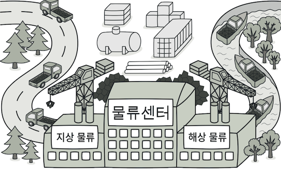
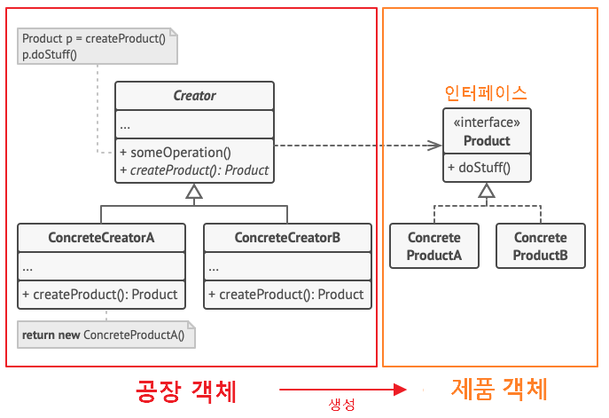
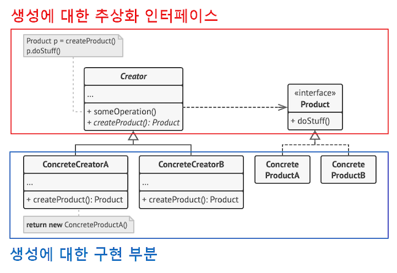
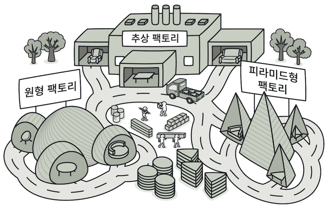
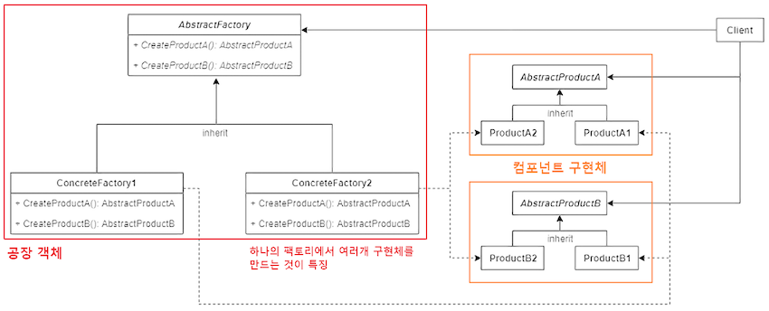

생성 디자인 패턴은 기존 코드의 유연성과 재사용을 증가시키는 객체를 생성하는 다양한 방법을 제공합니다.

---

# 1. 팩토리 메서드

> 다음 이름으로도 불립니다: 가상 생성자, Factory Method

팩토리 메서드는 `부모 클래스`에서 **객체들을 생성할 수 있는 인터페이스를 제공**하지만,
`자식 클래스들`이 **생성될 객체들의 유형을 변경할 수 있도록** 하는 생성 패턴입니다.

---

## 1.1

---

# 2. 추상 팩토리

추상 팩토리는 **관련 객체들의 구상 클래스들을 지정하지 않고도**,
관련 **객체들의 모음을 생성할 수 있도록** 하는 생성패턴입니다.

---

# 3. 빌더 패턴

빌더는 **복잡한 객체들을 단계별로 생성할 수 있도록** 하는 생성 디자인 패턴입니다.
이 패턴을 사용하면 **같은 제작 코드를 사용하여 객체의 다양한 유형들과 표현을 제작**할 수 있습니다.

---

# 4. 프로토타입 패턴

프로토타입은 **코드를 그들의 클래스들에 의존시키지 않고, 기존 객체들을 복사할 수 있도록** 하는 생성 디자인 패턴입니다.

---

# 5. 싱글턴 패턴

싱글턴은 클**래스에 인스턴스가 하나만 있도록 하면서, 이 인스턴스에 대한 전역 접근(액세스) 지점을 제공**하는 생성 디자인 패턴입니다.
