# 1. 어댑터 (Adaptor)

* 호환되지 않는 인터페이스를 가진 객체들이 협업할 수 있도록 하는 구조적 디자인 패턴
* 즉, 이름 그대로 **클래스를 어댑터로서 사용되는 구조 패턴**
* e.g. 어댑터는 우리 주변에도 많이 볼 수 있다.
  *  110V 전용 가전제품에 220V 어댑터를 끼워 사용하는 걸 들 수 있다. 
  * 즉, **서로 호환이 되지 않은 단자를 어댑터로 호환시켜 작동시키게끔 하는 것이 어댑터의 역할**이다.

이를 객체 지향 프로그래밍에 접목해보면, 
호환성이 없는 인터페이스 때문에 함께 동작할 수 없는 클래스들을 함께 작동해주도록 
변환 역할을 해주는 행동 패턴이라고 보면 된다.

e.g. 기존에 있는 시스템에 새로운 써드파티 라이브러리를 추가하고 싶거나, 
Legacy 인터페이스를 새로운 인터페이스로 교체하는 경우에 
어댑터 패턴을 사용하면 코드의 재사용성을 높일 수 있다.

즉, 어댑터란 이미 구축되어 있는 것을 새로운 어떤것에 사용할때 양 쪽 간의 호환성을 유지해 주기 위해 사용하는 것으로서, 
기존 시스템에서 새로운 업체에서 제공하는 기능을 사용하려고 할때 
서로 간의 인터페이스를 어댑터로 일치시켜줌으로써 호환성 및 신규 기능 확장을 할수 있다고 보면 된다.

------

## 1.1 어댑터 패턴 구조

Adapter 패턴에는 기존 시스템의 클래스를 **상속(Inheritance)** 해서 호환 작업을 해주냐, 
**합성(Composition)** 해서 호환 작업을 해주냐에 따라, 두 가지 패턴 방법으로 나뉘게 된다.

------

### 1.1.1 객체 어댑터 (Object Adaptor)

- 합성(Composition)된 맴버에게 위임을 이용한 어댑터 패턴 (추천 🌟)
- 자기가 해야 할 일을 **클래스 맴버 객체의 메소드에게 다시 시킴으로써 목적을 달성**하는 것을 `위임`이라고 한다.
- 합성을 활용했기 때문에 런타임 중에 Adaptee(Service)가 결정되어 유연하다.
- 그러나 Adaptee(Service) 객체를 필드 변수로 저장해야 되기 때문에 공간 차지 비용이 든다

1. `Adaptee(Service)` : 어댑터 대상 객체. 기존 시스템 / 외부 시스템 / 써드파티 라이브러리
2. `Target(Client Interface)` : Adapter 가 구현하는 인터페이스.
3. `Adapter` : Client 와 Adaptee(Service) 중간에서 호환성이 없는 둘을 연결시켜주는 역할을 담당.
   - Object Adaptor 방식에선 합성을 이용해 구성한다.
   - Adaptee(Service)를 따로 클래스 멤버로 설정하고 위임을 통해 동작을 매치시킨다.
4. `Client` : 기존 시스템을 어댑터를 통해 이용하려는 쪽. Client Interface를 통하여 Service를 이용할 수 있게 된다.

------

### 1.1.2 클래스 어댑터 (Class Adaptor)

- 클래스 상속을 이용한 어댑터 패턴
- Adaptee(Service)를 상속했기 때문에 따로 객체 구현없이 바로 코드 재사용이 가능하다.
- 상속은 대표적으로 기존에 구현된 코드를 재사용하는 방식이지만, 
  자바에서는 다중 상속 불가 문제 때문에 전반적으로 권장하지는 않는 방법이다

1. `Adaptee(Service)` : 어댑터 대상 객체. 기존 시스템 / 외부 시스템 / 써드파티 라이브러리
2. `Target(Cient Interface)` : Adapter 가 구현하는 인터페이스.
3. `Adapter` : Client 와 Adaptee(Service) 중간에서 호환성이 없는 둘을 연결시켜주는 역할을 담당.
   - Class Adaptor 방식에선 상속을 이용해 구성한다.
   - Existing Class와 Adaptee(Service) 를 동시에 implements, extends 하여 구현한다.
4. `Client` : 기존 시스템을 어댑터를 통해 이용하려는 쪽. Client Interface를 통하여 Service를 이용할 수 있게 된다.

------

## 1.2 적용 시기

* 레거시 코드를 사용하고 싶지만 새로운 인터페이스가 레거시 코드와 호환되지 않을 때
* 이미 만든 것을 재사용하고자 하나 이 재사용 가능한 라이브러리를 수정할 수 없을 때
* 이미 만들어진 클래스를 새로운 인터페이스(API)에 맞게 개조할때
* 소프트웨어의 구 버전과 신 버전을 공존시키고 싶을때

------

## 1.3 장점

* 단일 책임 원칙. 프로그램의 기본 비즈니스 로직에서 인터페이스 또는 데이터 변환 코드를 분리할 수 있습니다
* 개방/폐쇄 원칙. 클라이언트 코드가 클라이언트 인터페이스를 통해 어댑터와 작동하는 한, 
  * 기존의 클라이언트 코드를 손상시키지 않고 새로운 유형의 어댑터들을 프로그램에 도입할 수 있습니다.

------

## 1.4 단점

* 다수의 새로운 인터페이스와 클래스들을 도입해야 하므로 코드의 전반적인 복잡성이 증가합니다. 
  때로는 코드의 나머지 부분과 작동하도록 서비스 클래스를 변경하는 것이 더 간단합니다.

------

## 1.5 다른 패턴과의 관계

* `브리지`는 일반적으로 사전에 설계되며, 앱의 다양한 부분을 독립적으로 개발할 수 있도록 합니다. 
  * 반면에 어댑터는 일반적으로 기존 앱과 사용되어 원래 호환되지 않던 일부 클래스들이 서로 잘 작동하도록 합니다

* `어댑터`는 기존 객체의 인터페이스를 변경하는 반면, 
  * 데코레이터는 객체를 해당 객체의 인터페이스를 변경하지 않고 향상합니다.
  * 또한 데코레이터는 어댑터를 사용할 때는 불가능한 재귀적 합성을 지원합니다

* `어댑터`는 다른 인터페이스를, 프록시는 같은 인터페이스를, 
  * 데코레이터는 향상된 인터페이스를 래핑된 객체에 제공합니다

* `퍼사드`는 기존 객체들을 위한 새 인터페이스를 정의하는 반면, 
  * 어댑터는 기존의 인터페이스를 사용할 수 있게 만들려고 노력합니다.
  * 또 어댑터는 일반적으로 하나의 객체만 래핑하는 반면 퍼사드는 많은 객체의 하위시스템과 함께 작동합니다.

* `브리지, 상태, 전략 패턴`은 매우 유사한 구조로 되어 있으며, 
  * `어댑터 패턴`도 이들과 어느 정도 유사한 구조로 되어 있습니다.
  * 위 모든 패턴은 다른 객체에 작업을 위임하는 합성을 기반으로 합니다.
  * 하지만 이 패턴들은 모두 다른 문제들을 해결합니다.
  * 패턴은 특정 방식으로 코드의 구조를 짜는 레시피에 불과하지 않습니다.
  * 왜냐하면 패턴은 해결하는 문제를 다른 개발자들에게 전달할 수도 있기 때문입니다.

---

# 2. 브리지 (Bridge)

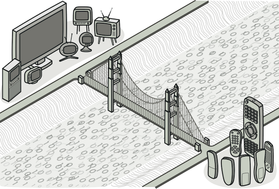

* 큰 클래스 또는 밀접하게 관련된 클래스들의 집합을 **2개의 개별 계층구조**(추상화 및 구현)로 나눈 후 
* **각각 독립적으로 개발할 수 있도록 하는 구조 디자인** 패턴
* 즉, **추상화와 구현을 분리하여 서로 독립적으로 변화할 수 있게 하는 디자인 패턴**

------

## 2.1 브리지 패턴 구조

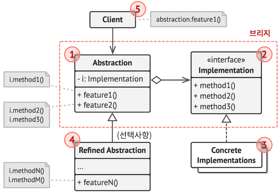

1. `추상화`는 상위 수준의 제어 논리를 제공하며, 구현 객체에 의존해 실제 하위 수준 작업들을 수행합니다.
2. `구현`은 모든 구상 구현들에 공통적인 인터페이스를 선언하며, 
   - 추상화는 여기에 선언된 메서드들을 통해서만 구현 객체와 소통할 수 있습니다. 
   - 추상화는 구현과 같은 메서드들을 나열할 수 있지만, 
   - 보통은 구현이 선언한 다양한 원시 작업들에 의존하는 몇 가지 복잡한 행동들을 선언합니다
3. `구상 구현들`에는 플랫폼별 맞춤형 코드가 포함됩니다.
4. 정제된 추상화들은 제어 논리의 변형들을 제공합니다. 
   - 그들은 그들의 부모처럼 일반 구현 인터페이스를 통해 다른 구현들과 작업합니다.
5. 일반적으로 클라이언트는 추상화와 작업하는데만 관심이 있습니다. 
   - 그러나 추상화 객체를 구현 객체들 중 하나와 연결하는 것도 클라이언트의 역할입니다.

------

## 2.2 장점

* 플랫폼 독립적인 클래스들과 앱들을 만들 수 있습니다.
* 클라이언트 코드는 상위 수준의 추상화를 통해 작동하며, 플랫폼 세부 정보에 노출되지 않습니다.
* 개방/폐쇄 원칙. 새로운 추상화들과 구현들을 상호 독립적으로 도입할 수 있습니다.
* 단일 책임 원칙. 추상화의 상위 수준 논리와 구현의 플랫폼 세부 정보에 집중할 수 있습니다

------

## 2.3 단점

* 결합도가 높은 클래스에 패턴을 적용하여 코드를 더 복잡하게 만들 수 있습니다.

------

## 2.4 다른 패턴과의 관계

* `브리지`는 일반적으로 사전에 설계되며, 앱의 다양한 부분을 독립적으로 개발할 수 있도록 합니다. 반면에 어댑터는 일반적으로 기존 앱과 사용되어 원래 호환되지 않던 일부 클래스들이 서로 잘 작동하도록 합니다
* `브리지, 상태, 전략 패턴`은 매우 유사한 구조로 되어 있으며, 어댑터 패턴도 이들과 어느 정도 유사한 구조로 되어 있습니다. 
  * 위 모든 패턴은 다른 객체에 작업을 위임하는 합성을 기반으로 합니다.
  * 하지만 이 패턴들은 모두 다른 문제들을 해결합니다.
  * 패턴은 특정 방식으로 코드의 구조를 짜는 레시피에 불과하지 않습니다.
  * 왜냐하면 패턴은 해결하는 문제를 다른 개발자들에게 전달할 수도 있기 때문입니다
* 당신은 `추상 팩토리`를 `브리지`와 함께 사용할 수 있습니다.
  * 이 조합은 브리지에 의해 정의된 어떤 추상화들이 특정 구현들과만 작동할 수 있을 때 유용합니다.
  * 이런 경우에 추상 팩토리는 이러한 관계들을 캡슐화하고 클라이언트 코드에서부터 복잡성을 숨길 수 있습니다
* `빌더`를 `브리지`와 조합할 수 있습니다. 
  * 디렉터 클래스는 추상화의 역할을 하고 다양한 빌더들은 구현의 역할을 합니다.

---

# 3. 복합체 (Composite)

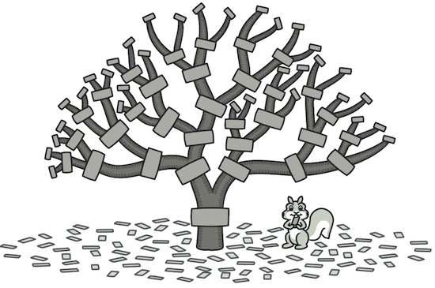

* **객체들을 트리 구조들로 구성**한 후, 이러한 **구조들과 개별 객체들처럼 작업**할 수 있도록 하는 구조 패턴
* 다시말해, **복합 객체(Composite)** 와 **단일 객체(Leaf)**를 동일한 컴포넌트로 취급하여, 
  * 클라이언트에게 이 둘을 구분하지 않고 동일한 인터페이스를 사용하도록 하는 구조 패턴
* 전체-부분의 관계를 갖는 객체들 사이의 관계를 트리 계층 구조로 정의해야 할때 유용하다.

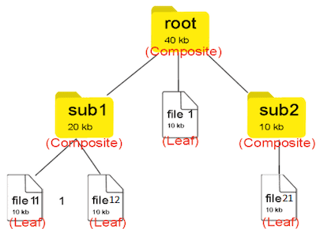

e.g. 윈도우나 리눅스의 **파일 시스템 구조**

* 폴더(디렉토리) 안에는 파일이 들어 있을수도 있고 파일을 담은 또 다른 폴더도 들어있을 수 있다.
* 이를 복합적으로 담을수 있다 해서 Composite 객체라고 불리운다.
* 반면 파일은 단일 객체 이기 때문에 이를 Leaf 객체라고 불리운다.
* 즉, Leaf는 자식이 없다

복합체 패턴은 바로 이 폴더와 파일을 동일한 타입으로 취급하여 구현을 단순화 시키는 것이 목적이다. 
폴더 안에는 파일 뿐만 아니라 서브 폴더가 올수 있고 또 서브 폴더안에 서브 폴더가 오고.. 이런식으로 계층 구조를 구현하다 보면, 
자칫 복잡해 질 수 도 있는 복합 객체를 **재귀 동작**을 통해 하위 객체들에게 작업을 위임한다.
그러면 복합 객체와 단일 객체를 대상으로 똑같은 작업을 적용할 수 있어 단일 / 복합 객체를 구분할 필요가 거의 없어진다.

> 윈도우에선 폴더와 파일은 엄연히 다른 놈이지만, 
> 리눅스(Unix)에선 디렉토리와 파일은 모두 파일로 취급된다.
> 어찌보면 리눅스 OS가 복합체(Composite) 패턴을 통해 계층 구조를 구현하였다고 볼 수 있다.
>
> 당연히 실제 설계는 다르겠지만, 
> 복합체 패턴은 입문하기 어려운 패턴중 하나이기에 이러한 비유를 통해 좀더 패턴에 친숙하게 접근하도록 해보자.

정리하면, Composite 패턴은 그릇과 내용물을 동일시해서 재귀적인 구조를 만들기 위한 디자인 패턴이라고 말할 수 있다.

------

## 3.1 Composite 패턴 구조

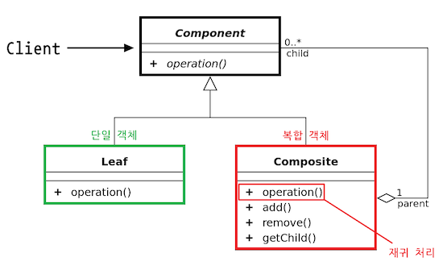

- `Component` : Leaf와 Compsite 를 묶는 공통적인 상위 인터페이스
- `Composite` : 복합 객체로서, Leaf 역할이나 Composite 역할을 넣어 관리하는 역할을 한다. 
  - Component 구현체들을 내부 리스트로 관리한다
  - add 와 remove 메소드는 내부 리스트에 단일 / 복합 객체를 저장
  - Component 인터페이스의 구현 메서드인 operation은 복합 객체에서 호출되면 재귀 하여, 추가 단일 객체를 저장한 하위 복합 객체를 순회하게 된다.
- `Leaf` : 단일 객체로서, 단순하게 내용물을 표시하는 역할을 한다.
  - Component 인터페이스의 구현 메서드인 operation은 단일 객체에서 호출되면 적절한 값만 반환한다
- `Client` : 클라이언트는 Component를 참조하여 단일 / 복합 객체를 하나의 객체로서 다룬다.

복합체 패턴의 핵심은 Composite 와 Leaf가 동시에 구현하는 operation() 인터페이스 추상 메서드를 정의하고, 
Composite 객체의 operation() 메서드는 자기 자신을 호출하는 재귀 형태로 구현하는 것이다. 

왜냐하면 폴더 안에 폴더를 넣고, 그 안에 또 폴더를 넣고 파일을 넣는 트리 구조를 생각해보면, 
재귀적으로 반복되는 형식이 나타나기 때문이다.
그래서 단일체와 복합체를 동일한 개체로 취급하여 처리하기 위해 재귀 함수 원리를 이용한다.

------

## 3.2 적용시기

* 데이터를 다룰때 **계층적** 트리 표현을 다루어야 할때
* 복잡하고 난해한 단일 / 복합 객체 관계를 간편히 단순화하여 균일하게 처리하고 싶을때

------

## 3.3 장점

* 단일체와 복합체를 동일하게 여기기 때문에 묶어서 연산하거나 관리할 때 편리하다.
* 다형성 재귀를 통해 복잡한 트리 구조를 보다 편리하게 구성 할 수 있다. 
* 수평적, 수직적 모든 방향으로 객체를 확장할 수 있다.
* 새로운 Leaf 클래스를 추가하더라도 클라이언트는 추상화된 인터페이스 만을 
  바라보기 때문에 [개방 폐쇄 원칙(OCP)Visit Website](https://inpa.tistory.com/entry/OOP-💠-아주-쉽게-이해하는-OCP-개방-폐쇄-원칙)을 준수 한다. (단일 부분의 확장이 용이)

------

## 3.4 단점

- 재귀 호출 특징 상 트리의 깊이(depth)가 깊어질 수록 디버깅에 어려움이 생긴다.
- 설계가 지나치게 범용성을 갖기 때문에 새로운 요소를 추가할 때 복합 객체에서 구성 요소에 제약을 갖기 힘들다.
- e.g. 계층형 구조에서 leaf 객체와 composite 객체들을 모두 동일한 인터페이스로 다루어야하는데, 
  이 공통 인터페이스 설계가 까다로울 수 있다.
  - 복합 객체가 가지는 부분 객체의 종류를 제한할 필요가 있을 때
  - 수평적 방향으로만 확장이 가능하도록 Leaf를 제한하는 Composite를 만들때

------

## 3.5 다른 패턴과의 관계

* 당신은 복잡한 복합체 패턴 트리를 생성할 때 빌더를 사용할 수 있습니다. 왜냐하면 빌더의 생성 단계들을 재귀적으로 작동하도록 프로그래밍할 수 있기 때문입니다
* 책임 연쇄 패턴은 종종 복합체 패턴과 함께 사용됩니다. 그러면 잎 컴포넌트가 요청을 받으면 해당 요청을 모든 부모 컴포넌트들의 체인을 통해 객체 트리의 뿌리(root)까지 전달할 수 있습니다.
* 당신은 반복자들을 사용하여 복합체 패턴 트리들을 순회할 수 있습니다
* 당신은 비지터 패턴을 사용하여 복합체 패턴 트리 전체를 대상으로 작업을 수행할 수 있습니다
* RAM을 절약하기 위하여 복합체 패턴 트리의 공유된 잎 노드들을 플라이웨이트들로 구현할 수 있습니다.
* 복합체 패턴 및 데코레이터는 둘 다 구조 다이어그램이 유사합니다. 왜냐하면 둘 다 재귀적인 합성에 의존하여 하나 또는 불특정 다수의 객체들을 정리하기 때문입니다.
  * 데코레이터는 복합체 패턴과 비슷하지만, 자식 컴포넌트가 하나만 있습니다. 또 다른 중요한 차이점은 데코레이터는 래핑된 객체에 추가 책임들을 추가하는 반면 복합체 패턴은 자신의 자식들의 결과를 '요약'하기만 합니다.
  * 그러나 패턴들은 서로 협력할 수도 있습니다: 데코레이터를 사용하여 복합체 패턴 트리의 특정 객체의 행동을 확장할 수 있습니다.
* 데코레이터 및 복합체 패턴을 많이 사용하는 디자인들은 프로토타입을 사용하면 종종 이득을 볼 수 있습니다. 프로토타입 패턴을 적용하면 복잡한 구조들을 처음부터 다시 건축하는 대신 복제할 수 있기 때문입니다

---

# 4. 데코레이터 (Decorator)

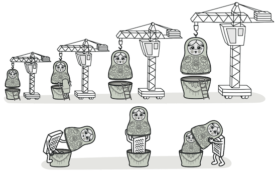

* 객체들을 새로운 행동들을 포함한 특수 래퍼 객체들 내에 넣어서, 
  * 위 행동들을 해당 객체들에 연결시키는 구조적 디자인 패턴
* 다시 말해, 대상 객체에 대한 기능 확장이나 변경이 필요할때, 
  * 객체의 결합을 통해 서브클래싱 대신 쓸수 있는 유연한 대안 구조 패턴
* Decorator을 해석하자면 '장식자' 라는 의미를 가지고 있는데, 
  * 마치 기본 제품에 포장지나 외부 디자인을 살짝 변경해 줌으로써 
  * 새로운 기능을 부여하는 것과 같이, 
  * 객체 지향 프로그래밍에서 원본 객체에 대해서 무언가를 장식하여 
  * 더 멋진 기능을 가지게 만드는 것이기 때문에 이 명칭이 붙었다고 보면 된다.
* 데코레이터 패턴을 이용하면 필요한 추가 기능의 조합을 런타임에서 동적으로 생성할 수 있다.
  * 데코레이터할 대상 객체를 새로운 행동들을 포함한 특수 장식자 객체에 넣어서 
  * 행동들을 해당 장식자 객체마다 연결시켜, 서브클래스로 구성할때 보다 훨씬 유연하게 기능을 확장 할 수 있다. 
  * 그리고 기능을 구현하는 클래스들을 분리함으로써 수정이 용이해진다.

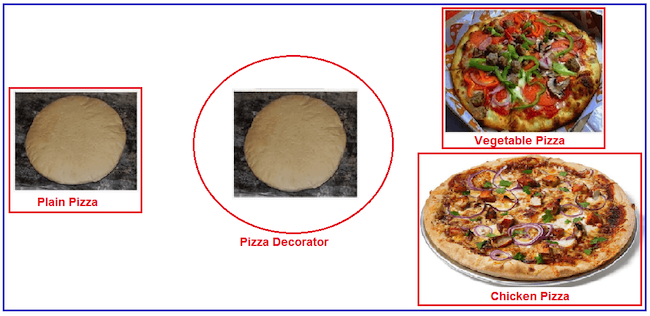

빵을 어떻게 데코레이팅하느냐에 따라 치킨 피자가 되고 야채 피자가 된다.

------

## 4.1 데코레이터 패턴 구조

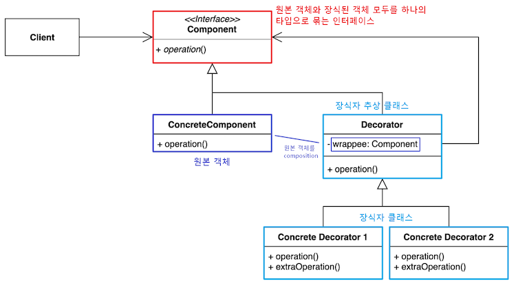

- `Component (Interface)` : 원본 객체와 장식된 객체 모두를 묶는 역할
- `ConcreteComponent` : 원본 객체 (데코레이팅 할 객체)
- `Decorator` : 추상화된 장식자 클래스
  - 원본 객체를 합성(composition)한 wrappee 필드와 인터페이스의 구현 메소드를 가지고 있다
- `ConcreteDecorator` : 구체적인 장식자 클래스
  - 부모 클래스가 감싸고 있는 하나의 Component를 호출하면서 호출 전/후로 부가적인 로직을 추가할 수 있다.

------

## 4.2 적용시기

* 객체 책임과 행동이 동적으로 상황에 따라 다양한 기능이 빈번하게 추가/삭제되는 경우
* 객체의 결합을 통해 기능이 생성될 수 있는 경우
* 객체를 사용하는 코드를 손상시키지 않고 런타임에 객체에 추가 동작을 할당할 수 있어야 하는 경우
* 상속을 통해 서브클래싱으로 객체의 동작을 확장하는 것이 어색하거나 불가능 할 때

------

## 4.3 장점

* 데코레이터를 사용하면 서브클래스를 만들때보다 훨씬 더 유연하게 기능을 확장할 수 있다.
* 객체를 여러 데코레이터로 래핑하여 여러 동작을 결합할 수 있다.
* 컴파일 타임이 아닌 런타임에 동적으로 기능을 변경할 수 있다.
* 각 장식자 클래스마다 고유의 책임을 가져 [단일 책임 원칙(SRP)Visit Website](https://inpa.tistory.com/entry/OOP-💠-아주-쉽게-이해하는-SRP-단일-책임-원칙)을 준수
* 클라이언트 코드 수정없이 기능 확장이 필요하면 장식자 클래스를 추가하면 되니 [개방 폐쇄 원칙(OCP)Visit Website](https://inpa.tistory.com/entry/OOP-💠-아주-쉽게-이해하는-OCP-개방-폐쇄-원칙)을 준수
* 구현체가 아닌 인터페이스를 바라봄으로써 [의존 역전 원칙(DIP)Visit Website](https://inpa.tistory.com/entry/OOP-💠-아주-쉽게-이해하는-DIP-의존-역전-원칙) 준수

------

## 4.4 단점

- 만일 장식자 일부를 제거하고 싶다면, Wrapper 스택에서 특정 wrapper를 제거하는 것은 어렵다.
- 데코레이터를 조합하는 초기 생성코드가 보기 안좋을 수 있다. new A(new B(new C(new D())))
- 어느 장식자를 먼저 데코레이팅 하느냐에 따라 데코레이터 스택 순서가 결정지게 되는데, 만일 순서에 의존하지 않는 방식으로 데코레이터를 구현하기는 어렵다.

------

## 4.5 다른 패턴과의 관계

* 어댑터는 기존 객체의 인터페이스를 변경하는 반면 데코레이터는 객체를 해당 객체의 인터페이스를 변경하지 않고 향상합니다. 또한 데코레이터는 어댑터를 사용할 때는 불가능한 재귀적 합성을 지원합니다
* 어댑터는 다른 인터페이스를, 프록시는 같은 인터페이스를, 데코레이터는 향상된 인터페이스를 래핑된 객체에 제공합니다.
* 책임 연쇄 패턴과 데코레이터는 클래스 구조가 매우 유사합니다. 두 패턴 모두 실행을 일련의 객체들을 통해 전달할 때 재귀적인 합성에 의존하나, 몇 가지 결정적인 차이점이 있습니다.
  * 책임 연쇄 패턴 핸들러들은 서로 독립적으로 임의의 작업을 실행할 수 있으며, 또한 해당 요청을 언제든지 더 이상 전달하지 않을 수 있습니다. 반면에 다양한 데코레이터들은 객체의 행동을 확장하며 동시에 이러한 행동을 기초 인터페이스와 일관되게 유지할 수 있습니다. 또한 데코레이터들은 요청의 흐름을 중단할 수 없습니다
* 복합체 패턴 및 데코레이터는 둘 다 구조 다이어그램이 유사합니다. 왜냐하면 둘 다 재귀적인 합성에 의존하여 하나 또는 불특정 다수의 객체들을 정리하기 때문입니다
  * 데코레이터는 복합체 패턴과 비슷하지만, 자식 컴포넌트가 하나만 있습니다. 또 다른 중요한 차이점은 데코레이터는 래핑된 객체에 추가 책임들을 추가하는 반면 복합체 패턴은 자신의 자식들의 결과를 '요약'하기만 합니다
  * 그러나 패턴들은 서로 협력할 수도 있습니다: 데코레이터를 사용하여 복합체 패턴 트리의 특정 객체의 행동을 확장할 수 있습니다.
* 데코레이터 및 복합체 패턴을 많이 사용하는 디자인들은 프로토타입을 사용하면 종종 이득을 볼 수 있습니다. 프로토타입 패턴을 적용하면 복잡한 구조들을 처음부터 다시 건축하는 대신 복제할 수 있기 때문입니다.
* 데코레이터는 객체의 피부를 변경할 수 있고 전략 패턴은 객체의 내장을 변경할 수 있다고 비유할 수 있습니다.
* 데코레이터와 프록시의 구조는 비슷하나 이들의 의도는 매우 다릅니다. 두 패턴 모두 한 객체가 일부 작업을 다른 객체에 위임해야 하는 합성 원칙을 기반으로 합니다. 이 두 패턴의 차이점은 프록시는 일반적으로 자체적으로 자신의 서비스 객체의 수명 주기를 관리하는 반면 데코레이터의 합성은 항상 클라이언트에 의해 제어된다는 점입니다.

---

# 5. 퍼샤드 (Facade)

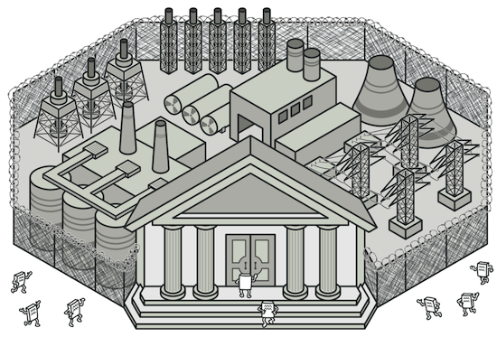

* 라이브러리에 대한, 프레임워크에 대한 또는 다른 클래스들의 복잡한 집합에 대한 
  * 단순화된 인터페이스를 제공하는 구조적 디자인 패턴
* 즉, 사용하기 복잡한 클래스 라이브러리에 대해 사용하기 편하게 간편한 인터페이스(API)를 구성하기 위한 구조 패턴
* e.g. 라이브러리의 각 클래스와 메서드들이 어떤 목적의 동작인지 이해하기 어려워 바로 가져다 쓰기에는 난이도가 높을때, 
  * 이에 대한 적절한 네이밍과 정리를 통해 사용자로 하여금 쉽게 라이브러리를 다룰수 있도록 인터페이스를 만드는데, 
  * 우리가 **교제를 보고 필기노트에 재정리를 하듯이 클래스를 재정리하는 행위**로 보면 된다.

본래 프로그램이라는 것은 업데이트를 통해 점점 커지게 된다. 

* 버전이 올라갈수록 많은 클래스들이 만들어져 서로 관계를 맺으면서 점점 복잡해지게 된다.
* 그래서 커다란 솔루션을 구성하려면 상호 관련된 많은 클래스들을 적절히 제어해야 할 필요성이 있다.
* 이때 이 처리를 개별적으로 제어하는 것이 아닌 일종의 **'창구'**를 준비하여 중계할 수 있도록 구성해준다면, 
* 사용자는 창구를 통해서 간단한 명령 요구만 내리면 
* 요구에 대해 필요한 모든 집약적 행위들을 창구가 알아서 처리해 결과를 내주게 된다.

고객은 복잡한 절차 지식없이 고객센터(창구)에 요구만 하면 결과를 얻는다

이처럼 퍼사드(Facade) 패턴은 복잡하게 얽혀 있는 것을 정리해서 사용하기 편한 인터페이스를 고객에게 제공한다고 보면된다. 
그래서 고객은 복잡한 시스템을 알 필요없이 시스템의 외부에 대해서 단순한 인터페이스를 이용하기만 하면 된다. 
퍼사드를 이용하면 자칫 동작의 목적과 같은 중요한 사항을 놓치는 실수를 줄일 수 있다.

> 💡 Facade 단어의 정의
>
> 
>
> Facade라는 단어의 뜻은 건축물의 정면을 의미한다. 
> 건축물의 정면은 보통 건축물의 이미지와 건축 의도를 나타내기 때문에 
> 오래 전부터 특별한 디자인을 적용하여 의미를 부여했다. 
> 이처럼 건축물 정면만 봐도 이 건물이 어떤 목적을 하는지 단번에 알수 있다는 특징을 차용하여 명명 지은 것이다.

------

## 5.1 퍼샤드 패턴 구조

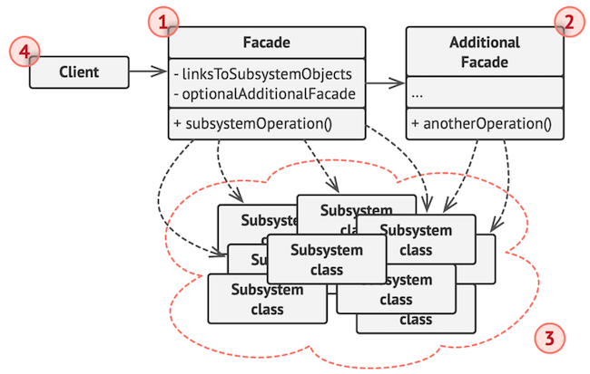

- `Facade` : 서브시스템 기능을 편리하게 사용할 수 있도록 하기 위해 
  - 여러 시스템과 상호 작용하는 복잡한 로직을 재정리해서 높은 레벨의 인터페이스를 구성한다.
  - Facade 역할은 서브 시스템의 많은 역할에 대해 ‘단순한 창구’가 된다.
  - 클라이언트와 서브시스템이 서로 긴밀하게 연결되지 않도록 한다.
- `Additional Facade` : 퍼사드 클래스는 반드시 한개만 존재해야 한다는 규칙같은 건 없다.
  - 연관 되지 않은 기능이 있다면 얼마든지 퍼사드 2세로 분리한다.
  - 이 퍼사드 2세는 다른 퍼사드에서 사용할 수도 있고 클라이언트에서 직접 접근할 수도 있다.
- `SubSystem(하위 시스템)` : 수십 가지 라이브러리 혹은 클래스들
- `Client` : 서브 시스템에 직접 접근하는 대신 Facade를 사용한다.

퍼사드 패턴은 전략 패턴이나 팩토리 패턴과 같은 여타 다른 디자인 패턴과는 다르게 **클래스 구조가 정형화 되지 않은 패턴**이다.
반드시 클래스 위치는 어떻고 어떤 형식으로 위임을 해야되고 이런것이 없다.
그냥 퍼사드 클래스를 만들어 적절히 기능 집약화만 해주면 그게 디자인 패턴이 되는 것이다. (패턴이라기 보단 논리에 가깝다)

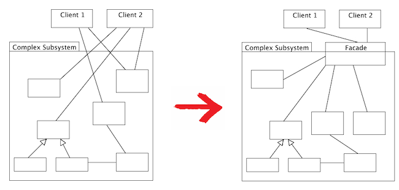

Client들은 복잡한 Subsystem을 의식하지않고 Facade라는 창구를 통해 결과를 얻는다

C언어나 파이썬에서 어떠한 복잡한 로직의 코드가 있으면 이걸 main 함수에서 모두 실행하는 것이 아니라, 
함수(function) 분리를 통해 main 함수의 코드를 심플하게 구성해본 경험이 있을 것이다.
이를 객체 지향 프로그래밍 관점으로 치환한 것이 퍼사드 패턴이다.
즉, 퍼사드는 복잡한 것(내부에서 실행되고 있는 많은 클래스의 관계나 사용법)을 단순하게 보여주는 것에 초점을 둔다.
클라이언트로 하여금 복잡한 것을 의식하지 않도록 해주는 것이다.

> 💡 재귀적인 Facade 패턴의 적용
>
> **재귀적 퍼사드**란 위에서 언급한 **Additional Facade** 를 말하는 것이다. 
>
> e.g. 다수의 클래스, 다수의 패키지를 포함하고 있는 큰 시스템에 요소 요소 마다 Facade 패턴을 여기 저기 적용하고 다시 그 Facade를 합친 Facade를 만드는 식으로, 퍼사드를 재귀적으로 구성하면 시스템은 보다 편리하게 된다. 이처럼 퍼사드는 한개만 있으라는 법은 없으며 필요에 의하면 얼마든지 늘려 의존할 수 있다.

------

## 5.2 적용 시기

- 시스템이 너무 복잡할때
- 그래서 간단한 인터페이스를 통해 복잡한 시스템을 접근하도록 하고 싶을때
- 시스템을 사용하고 있는 외부와 결합도가 너무 높을 때 의존성 낮추기 위할때

------

## 5.3 장점

- 하위 시스템의 복잡성에서 코드를 분리하여, 외부에서 시스템을 사용하기 쉬워진다.
- 하위 시스템 간의 의존 관계가 많을 경우 이를 감소시키고 의존성을 한 곳으로 모을 수 있다.
- 복잡한 코드를 감춤으로써, 클라이언트가 시스템의 코드를 모르더라도 Facade 클래스만 이해하고 사용 가능하다. 

> 외부에서 내부 로직을 직접 사용하기 떄문에 내부 로직의 구조를 변경한다고 하거나 파라미터나 리턴값 등을 변경할 경우 직접적으로 영향을 받아 수정이힘들거나 불가능한 경우가 종종 있다. 하지만 중간에 매개체 역할을 해주는 퍼사드 객체가 있기 때문에 실제 내부 로직이 어떻게 변경이 되더라도 상관이 없어지므로 의존성이 감소된다.

------

## 5.4 단점

- 퍼사드가 앱의 모든 클래스에 결합된 God 객체가 될 수 있다
- 퍼사드 클래스 자체가 서브시스템에 대한 의존성을 가지게 되어 의존성을 완전히는 피할 수는 없다.
- 어찌되었건 추가적인 코드가 늘어나는 것이기 때문에 유지보수 측면에서 공수가 더 많이 들게 된다.
- 따라서 추상화 하고자하는 시스템이 얼마나 복잡한지 퍼사드 패턴을 통해서 얻게 되는 이점과 추가적인 유지보수 비용을 비교해보며 결정하여야 한다.

------

## 5.5 다른 패턴과의 관계

* 퍼사드는 기존 객체들을 위한 새 인터페이스를 정의하는 반면 어댑터는 기존의 인터페이스를 사용할 수 있게 만들려고 노력합니다. 또 어댑터는 일반적으로 하나의 객체만 래핑하는 반면 퍼사드는 많은 객체의 하위시스템과 함께 작동합니다.
* 추상 팩토리는 하위시스템 객체들이 클라이언트 코드에서 생성되는 방식만 숨기고 싶을 때 퍼사드 대신 사용할 수 있습니다.
* 플라이웨이트는 작은 객체들을 많이 만드는 방법을 보여 주는 반면 퍼사드 패턴은 전체 하위 시스템을 나타내는 단일 객체를 만드는 방법을 보여 줍니다.
* 중재자와 퍼사드 패턴은 비슷한 역할을 합니다. 둘 다 밀접하게 결합된 많은 클래스 간의 협업을 구성하려고 합니다.
  * 퍼사드 패턴은 객체들의 하위 시스템에 대한 단순화된 인터페이스를 정의하지만 새로운 기능을 도입하지는 않습니다
  * 하위 시스템 자체는 퍼사드를 인식하지 못하며, 하위 시스템 내의 객체들은 서로 직접 통신할 수 있습니다.
  * 중재자는 시스템 컴포넌트 간의 통신을 중앙 집중화합니다. 컴포넌트들은 중재자 객체에 대해서만 알며 서로 직접 통신하지 않습니다.
* 대부분의 경우 하나의 퍼사드 객체만 있어도 충분하므로 퍼사드 패턴의 클래스는 종종 싱글턴으로 변환될 수 있습니다.
* 퍼사드 패턴은 복잡한 객체 또는 시스템을 보호하고 자체적으로 초기화한다는 점에서 프록시와 유사합니다. 퍼사드 패턴과 달리 프록시는 자신의 서비스 객체와 같은 인터페이스를 가지므로 이들은 서로 상호 교환이 가능합니다.

---

# 6. 경량 (Flyweight)

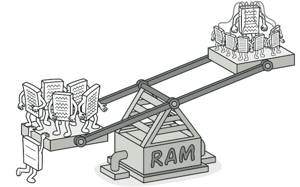

* 재사용 가능한 객체 인스턴스를 공유시켜 메모리 사용량을 최소화하는 구조 패턴
* 간단히 말하면 캐시(Cache) 개념을 코드로 패턴화 한것으로 보면 되는데, 
  * 자주 변화는 속성(extrinsit)과 변하지 않는 속성(intrinsit)을 분리하고, 
  * 변하지 않는 속성을 캐시하여 재사용해 메모리 사용을 줄이는 방식
  * 그래서 동일하거나 유사한 객체들 사이에 가능한 많은 데이터를 서로 공유하여, 
  * 사용하도록 하여 최적화를 노리는 **경량 패턴**이라고도 불린다.
* 각 객체에 모든 데이터를 유지하는 대신 여러 객체들 간에 상태의 공통 부분들을 공유하여, 
  * 사용할 수 있는 RAM에 더 많은 객체들을 포함할 수 있도록 하는 구조 디자인 패턴
* 위 그림은 객체를 일일히 생성한것과 객체를 공유 상태로 만든 것에 대한 메모리 무게 차이

> Flyweight 단어 의미는 Fly(가벼운) + Weight(무게)를 뜻함으로써, 복싱의 체급에서 유래되었다.
> 이를 자바 프로그래밍에 접목해보면 모든 객체를 일일히 인스턴스화 하지않고, 
> 재사용할수 있는 객체는 재사용함으로써 메모리를 가볍게 만든다는 의미로서 쓰인다보 보면 된다

------

## 6.1 플라이웨이트 패턴 구조

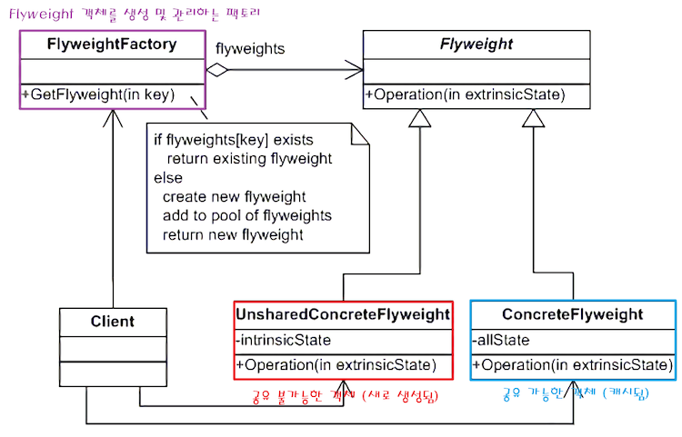

- **Flyweight** : 경량 객체를 묶는 인터페이스.
- **ConcreteFlyweight** : 공유 가능하여 재사용되는 객체 **(intrinsic state)**
- **UnsahredConcreteFlyweight** : 공유 불가능한 객체 **(extrinsic state)**
- FlyweightFactory : 경량 객체를 만드는 공장 역할과 캐시 역할을 겸비하는 Flyweight 객체 관리 클래스
  - GetFlyweight() 메서드는 팩토리 메서드 역할을 한다고 보면 된다.
  - 만일 객체가 메모리에 존재하면 그대로 가져와 반환하고, 없다면 새로 생성해 반환한다
- **Client** : 클라이언트는 FlyweightFactory를 통해 Flyweight 타입의 객체를 얻어 사용한다.

### 6.1.1 intrinsic 와 extrinsic 상태

플라이웨이트 패턴에서 가장 주의 깊게 보아야 할 점이 바로 **Intrinsic와 Extrinsic의 상태를 구분**하는 것이다.

**intrinsic**란 '고유한, 본질적인' 이라는 의미를 가진다. 본질적인 상태란 인스턴스가 어떠한 상황에서도 변하지 않는 정보를 말한다. 
그래서 값이 고정되어 있기에 충분히 언제 어디서 공유해도 문제가 없게 된다.

**extrinsic**이란 '외적인, 비본질적인' 이라는 의미를 가진다. 인스턴스를 두는 장소나 상황에 따라서 변화하는 정보를 말한다. 
그래서 값이 언제 어디서 변화할지 모르기 때문에 이를 캐시해서 공유할수 는 없다.

- intrinsic한 객체 : 장소나 상황에 의존하지 않기 때문에 값이 고정되어 공유할 수 있는 객체
- extrinsic한 객체 : 장소나 상황에 의존하기 때문에 매번 값이 바뀌어 공유할 수 없는 객체

폭탄 피하기 게임을 예를 들어보자.

무수히 떨어지는 폭탄 들은 모두 하나의 객체일 것인데, 이 폭탄 객체들을 일일히 new 를 통해 인스턴스화하면 객체를 생성 할때마다 메모리를 차지하게 되어 게임이 무거워질 것이다. 떨어지는 폭탄 객체는 어차피 모두 같기 때문에 이를 일일히 생성하는건 중복이기 때문이다. 따라서 이 폭탄을 플라이웨이트로 처리함으로써 폭탄 인스턴스는 하나만 만들고 공유하여 이를 가져와 화면에 흩뿌리면 될 일이다. 그런데 여기서 플라이웨이트 적용 기준이 되는 상태를 구분할 필요가 있다

우선 떨어지는 폭탄들이 가지고 있는 정보는 다음과 같다고 한다.

1. 폭탄 모양
2. 폭탄 색깔
3. 폭탄 x, y 좌표 위치

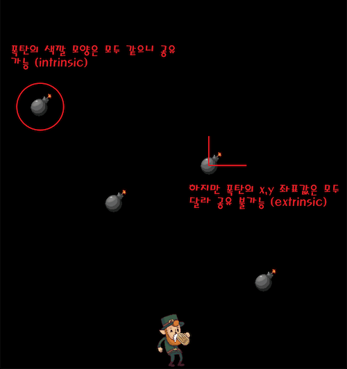

여기서 폭탄 모양이나 색깔 값은 본질적인 폭탄 상태를 나타나기 때문에 캐시하여 여러 곳에 공유할 수 있다. 반면 폭탄 객체의 x, y 좌표 값은 실시간으로 변화하기 때문에 이를 캐시하여 공유할 수는 없다.

따라서 폭탄 클래스 구조를 플라이웨이트 디자인 패턴으로 표현한다면, 폭탄의 형태나 색깔 같은 고정 정보를 포함하고 있는 객체는 ConcreteFlyweight로 구현 되고, 폭탄의 좌표값 같은 정보를 변화 정보를 포함하고 있는 객체는 UnsahredConcreteFlyweight로 구현 되게 된다. 그리고 이 폭탄 객체를 FlyweightFactory가 생성하고 캐싱하고 관리를 하는 것이다.

------

## 6.2 적용시기

- 어플리케이션에 의해 생성되는 객체의 수가 많아 저장 비용이 높아질 때
- 생성된 객체가 오래도록 메모리에 상주하며 사용되는 횟수가 많을때
- 공통적인 인스턴스를 많이 생성하는 로직이 포함된 경우
- 임베디드와 같이 메모리를 최소한으로 사용해야하는 경우에 활용

------

## 6.3 장점

- 애플리케이션에서 사용하는 메모리를 줄일 수 있다.
- 프로그램 속도를 개선 할수 있다.
  - new로 인스턴스화를 하면 데이터가 생성되고 메모리에 적재 되는 미량의 시간이 걸리게 된다.
  - 객체를 공유하면 인스턴스를 가져오기만 하면 되기 때문에 메모리 뿐만 아니라 속도도 향상시킬 수 있게 되는 것이다.

------

## 6.4 단점

- 아무래도 코드의 복잡도가 증가한다.

---

# 7. 프록시 (Proxy)

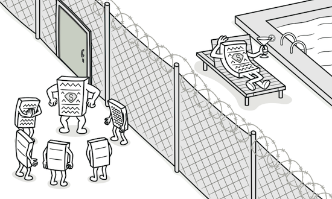

* 대상 원본 객체를 **대리하여 대신 처리하게 함으로써 로직의 흐름을 제어**하는 행동 패턴
* 다른 객체에 대한 대체 또는 자리표시자를 제공할 수 있는 구조 디자인 패턴
* 프록시는 원래 객체에 대한 접근을 제어하므로,
  * 당신의 요청이 원래 객체에 전달되기 전 또는 후에 무언가를 수행할 수 있도록 합니다.
* 프록시(Proxy)의 사전적인 의미는 '대리인'이라는 뜻이다. 
  * 즉, 누군가에게 어떤 일을 대신 시키는 것을 의미하는데, 
  * 이를 객체 지향 프로그래밍에 접목해보면 클라이언트가 대상 객체를 직접 쓰는게 아니라, 
  * 중간에 프록시(대리인)을 거쳐서 쓰는 코드 패턴이라고 보면 된다. 
  * 따라서 대상 객체(Subject)의 메소드를 직접 실행하는 것이 아닌, 
  * 대상 객체에 접근하기 전에 프록시(Proxy) 객체의 메서드를 접근한 후 추가적인 로직을 처리한뒤 접근하게 된다.

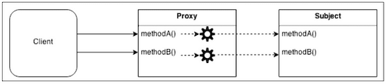

그냥 객체를 이용하면 되지, 이렇게 번거롭게 중계 대리자를 통해 이용하는 방식을 취하는 이유는, 
대상 클래스가 민감한 정보를 가지고 있거나 인스턴스화 하기에 무겁거나 추가 기능을 가미하고 싶은데, 
**원본 객체를 수정할수 없는 상황일 때를 극복**하기 위해서이다.
대체적으로 정리하자면 다음과 같은 효과를 누릴수 있다고 보면 된다.

1. `보안(Security)` : 프록시는 클라이언트가 작업을 수행할 수 있는 권한이 있는지 확인하고 검사 결과가 긍정적인 경우에만 요청을 대상으로 전달한다.
2. `캐싱(Caching)` : 프록시가 내부 캐시를 유지하여 데이터가 캐시에 아직 존재하지 않는 경우에만 대상에서 작업이 실행되도록 한다.
3. `데이터 유효성 검사(Data validation)` : 프록시가 입력을 대상으로 전달하기 전에 유효성을 검사한다.
4. `지연 초기화(Lazy initialization)` : 대상의 생성 비용이 비싸다면 프록시는 그것을 필요로 할때까지 연기할 수 있다.
5. `로깅(Logging)` : 프록시는 메소드 호출과 상대 매개 변수를 인터셉트하고 이를 기록한다.
6. `원격 객체(Remote objects)` : 프록시는 원격 위치에 있는 객체를 가져와서 로컬처럼 보이게 할 수 있다.

------

## 7.1 프록시 패턴 구조

프록시는 다른 객체에 대한 접근을 제어하는 개체이다. 여기서 다른 객체를 **대상(Subject)**라고 부른다.
프록시와 대상은 동일한 인터페이스를 가지고 있으며 이를 통해 다른 인터페이스와 완전히 호환되도록 바꿀수 있다.

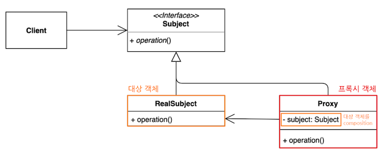

- `Subject` : Proxy와 RealSubject를 하나로 묶는 인터페이스 (다형성)
  - 대상 객체와 프록시 역할을 동일하게 하는 추상 메소드 operation() 를 정의한다.
  - 인터페이스가 있기 때문에 클라이언트는 Proxy 역할과 RealSubject 역할의 차이를 의식할 필요가 없다.
- `RealSubject` : 원본 대상 객체
- `Proxy` : 대상 객체(RealSubject)를 중계할 대리자 역할
  - 프록시는 대상 객체를 합성(composition)한다.
  - 프록시는 대상 객체와 같은 이름의 메서드를 호출하며, 별도의 로직을 수행 할수 있다 (인터페이스 구현 메소드)
  - 프록시는 흐름제어만 할 뿐 결과값을 조작하거나 변경시키면 안 된다.
- `Client` : Subject 인터페이스를 이용하여 프록시 객체를 생성해 이용.
  - 클라이언트는 프록시를 중간에 두고 프록시를 통해서 RealSubject와 데이터를 주고 받는다.

------

## 7.2 적용 시기

- 접근을 제어하거가 기능을 추가하고 싶은데, **기존의 특정 객체를 수정할 수 없는 상황일때**
- 초기화 지연, 접근 제어, 로깅, 캐싱 등, 기존 객체 동작에 수정 없이 가미하고 싶을 때

------

## 7.3 장점

* 개방 폐쇄 원칙(OCP) 준수
  - 기존 대상 객체의 코드를 변경하지 않고 새로운 기능을 추가할 수 있다.
* 단일 책임 원칙(SRP) 준수 
  - 대상 객체는 자신의 기능에만 집중 하고, 그 이외 부가 기능을 제공하는 역할을 프록시 객체에 위임하여 다중 책임을 회피 할 수 있다.
* 원래 하려던 기능을 수행하며 그외의 부가적인 작업(로깅, 인증, 네트워크 통신 등)을 수행하는데 유용하다
* 클라이언트는 객체를 신경쓰지 않고, 서비스 객체를 제어하거나 생명 주기를 관리할 수 있다.
* 사용자 입장에서는 프록시 객체나 실제 객체나 사용법은 유사하므로 사용성에 문제 되지 않는다.

------

## 7.4 단점

* 많은 프록시 클래스를 도입해야 하므로 코드의 복잡도가 증가한다.
  - e.g. 여러 클래스에 로깅 기능을 가미 시키고 싶다면, 동일한 코드를 적용함에도 각각의 클래스에 해당되는 프록시 클래스를 만들어서 적용해야 되기 때문에 코드량이 많아지고 중복이 발생 된다.
  - 자바에서는 리플렉션에서 제공하는 동적 프록시(Dynamic Proxy) 기법을 이용해서 해결할 수 있다. (후술)
* 프록시 클래스 자체에 들어가는 자원이 많다면 서비스로부터의 응답이 늦어질 수 있다.

------

## 7.5 다른 패턴과의 관계

* 어댑터는 다른 인터페이스를, 프록시는 같은 인터페이스를, 데코레이터는 향상된 인터페이스를 래핑된 객체에 제공합니다.
* 퍼사드 패턴은 복잡한 객체 또는 시스템을 보호하고 자체적으로 초기화한다는 점에서 프록시와 유사합니다. 퍼사드 패턴과 달리 프록시는 자신의 서비스 객체와 같은 인터페이스를 가지므로 이들은 서로 상호 교환이 가능합니다.
* 데코레이터와 프록시의 구조는 비슷하나 이들의 의도는 매우 다릅니다. 두 패턴 모두 한 객체가 일부 작업을 다른 객체에 위임해야 하는 합성 원칙을 기반으로 합니다. 이 두 패턴의 차이점은 프록시는 일반적으로 자체적으로 자신의 서비스 객체의 수명 주기를 관리하는 반면 데코레이터의 합성은 항상 클라이언트에 의해 제어된다는 점입니다.
