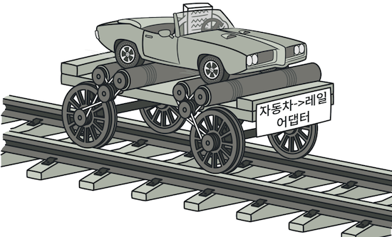
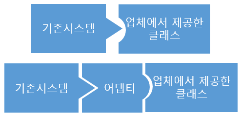
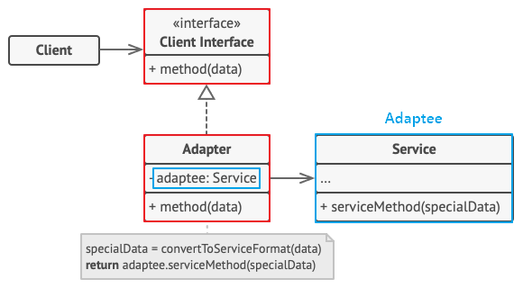
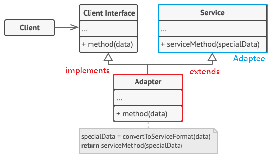

# 1. 어댑터 (Adaptor)

* 호환되지 않는 인터페이스를 가진 객체들이 협업할 수 있도록 하는 구조적 디자인 패턴
* 즉, 이름 그대로 **클래스를 어댑터로서 사용되는 구조 패턴**
* e.g. 어댑터는 우리 주변에도 많이 볼 수 있다.
  *  110V 전용 가전제품에 220V 어댑터를 끼워 사용하는 걸 들 수 있다. 
  * 즉, **서로 호환이 되지 않은 단자를 어댑터로 호환시켜 작동시키게끔 하는 것이 어댑터의 역할**이다.

이를 객체 지향 프로그래밍에 접목해보면, 
호환성이 없는 인터페이스 때문에 함께 동작할 수 없는 클래스들을 함께 작동해주도록 
변환 역할을 해주는 행동 패턴이라고 보면 된다.

e.g. 기존에 있는 시스템에 새로운 써드파티 라이브러리를 추가하고 싶거나, 
Legacy 인터페이스를 새로운 인터페이스로 교체하는 경우에 
어댑터 패턴을 사용하면 코드의 재사용성을 높일 수 있다.

즉, 어댑터란 이미 구축되어 있는 것을 새로운 어떤것에 사용할때 양 쪽 간의 호환성을 유지해 주기 위해 사용하는 것으로서, 
기존 시스템에서 새로운 업체에서 제공하는 기능을 사용하려고 할때 
서로 간의 인터페이스를 어댑터로 일치시켜줌으로써 호환성 및 신규 기능 확장을 할수 있다고 보면 된다.

------

## 1.1 어댑터 패턴 구조

Adapter 패턴에는 기존 시스템의 클래스를 **상속(Inheritance)** 해서 호환 작업을 해주냐, 
**합성(Composition)** 해서 호환 작업을 해주냐에 따라, 두 가지 패턴 방법으로 나뉘게 된다.

------

### 1.1.1 객체 어댑터 (Object Adaptor)

- 합성(Composition)된 맴버에게 위임을 이용한 어댑터 패턴 (추천 🌟)
- 자기가 해야 할 일을 **클래스 맴버 객체의 메소드에게 다시 시킴으로써 목적을 달성**하는 것을 `위임`이라고 한다.
- 합성을 활용했기 때문에 런타임 중에 Adaptee(Service)가 결정되어 유연하다.
- 그러나 Adaptee(Service) 객체를 필드 변수로 저장해야 되기 때문에 공간 차지 비용이 든다

1. `Adaptee(Service)` : 어댑터 대상 객체. 기존 시스템 / 외부 시스템 / 써드파티 라이브러리
2. `Target(Client Interface)` : Adapter 가 구현하는 인터페이스.
3. `Adapter` : Client 와 Adaptee(Service) 중간에서 호환성이 없는 둘을 연결시켜주는 역할을 담당.
   - Object Adaptor 방식에선 합성을 이용해 구성한다.
   - Adaptee(Service)를 따로 클래스 멤버로 설정하고 위임을 통해 동작을 매치시킨다.
4. `Client` : 기존 시스템을 어댑터를 통해 이용하려는 쪽. Client Interface를 통하여 Service를 이용할 수 있게 된다.

------

### 1.1.2 클래스 어댑터 (Class Adaptor)

- 클래스 상속을 이용한 어댑터 패턴
- Adaptee(Service)를 상속했기 때문에 따로 객체 구현없이 바로 코드 재사용이 가능하다.
- 상속은 대표적으로 기존에 구현된 코드를 재사용하는 방식이지만, 
  자바에서는 다중 상속 불가 문제 때문에 전반적으로 권장하지는 않는 방법이다

1. `Adaptee(Service)` : 어댑터 대상 객체. 기존 시스템 / 외부 시스템 / 써드파티 라이브러리
2. `Target(Cient Interface)` : Adapter 가 구현하는 인터페이스.
3. `Adapter` : Client 와 Adaptee(Service) 중간에서 호환성이 없는 둘을 연결시켜주는 역할을 담당.
   - Class Adaptor 방식에선 상속을 이용해 구성한다.
   - Existing Class와 Adaptee(Service) 를 동시에 implements, extends 하여 구현한다.
4. `Client` : 기존 시스템을 어댑터를 통해 이용하려는 쪽. Client Interface를 통하여 Service를 이용할 수 있게 된다.

------

## 1.2 적용 시기

* 레거시 코드를 사용하고 싶지만 새로운 인터페이스가 레거시 코드와 호환되지 않을 때
* 이미 만든 것을 재사용하고자 하나 이 재사용 가능한 라이브러리를 수정할 수 없을 때
* 이미 만들어진 클래스를 새로운 인터페이스(API)에 맞게 개조할때
* 소프트웨어의 구 버전과 신 버전을 공존시키고 싶을때

------

## 1.3 장점

* 단일 책임 원칙. 프로그램의 기본 비즈니스 로직에서 인터페이스 또는 데이터 변환 코드를 분리할 수 있습니다
* 개방/폐쇄 원칙. 클라이언트 코드가 클라이언트 인터페이스를 통해 어댑터와 작동하는 한, 기존의 클라이언트 코드를 손상시키지 않고 새로운 유형의 어댑터들을 프로그램에 도입할 수 있습니다.

------

## 1.4 단점

* 다수의 새로운 인터페이스와 클래스들을 도입해야 하므로 코드의 전반적인 복잡성이 증가합니다. 
  때로는 코드의 나머지 부분과 작동하도록 서비스 클래스를 변경하는 것이 더 간단합니다.

------

## 1.5 다른 패턴과의 관계

* `브리지`는 일반적으로 사전에 설계되며, 앱의 다양한 부분을 독립적으로 개발할 수 있도록 합니다. 
  * 반면에 어댑터는 일반적으로 기존 앱과 사용되어 원래 호환되지 않던 일부 클래스들이 서로 잘 작동하도록 합니다

* `어댑터`는 기존 객체의 인터페이스를 변경하는 반면, 
  * 데코레이터는 객체를 해당 객체의 인터페이스를 변경하지 않고 향상합니다.
  * 또한 데코레이터는 어댑터를 사용할 때는 불가능한 재귀적 합성을 지원합니다

* `어댑터`는 다른 인터페이스를, 프록시는 같은 인터페이스를, 
  * 데코레이터는 향상된 인터페이스를 래핑된 객체에 제공합니다

* `퍼사드`는 기존 객체들을 위한 새 인터페이스를 정의하는 반면, 
  * 어댑터는 기존의 인터페이스를 사용할 수 있게 만들려고 노력합니다.
  * 또 어댑터는 일반적으로 하나의 객체만 래핑하는 반면 퍼사드는 많은 객체의 하위시스템과 함께 작동합니다.

* `브리지, 상태, 전략 패턴`은 매우 유사한 구조로 되어 있으며, 
  * `어댑터 패턴`도 이들과 어느 정도 유사한 구조로 되어 있습니다.
  * 위 모든 패턴은 다른 객체에 작업을 위임하는 합성을 기반으로 합니다.
  * 하지만 이 패턴들은 모두 다른 문제들을 해결합니다.
  * 패턴은 특정 방식으로 코드의 구조를 짜는 레시피에 불과하지 않습니다.
  * 왜냐하면 패턴은 해결하는 문제를 다른 개발자들에게 전달할 수도 있기 때문입니다

---

# 2. 브리지 (Bridge)

---

# 3. 복합체 (Composite)

---

# 4. 데코레이터 (Decorator)

---

# 5. 퍼샤드 (Facade)

---

# 6. 플라이웨이트 (Flyweight)

---

# 7. 프록시 (Proxy)
