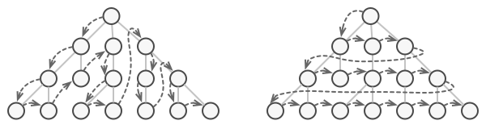

# 1. 책임 연쇄 (Chain of Responsibility)

*  핸들러들의 체인(사슬)을 따라 요청을 전달할 수 있게 해주는 행동 디자인 패턴
* 각 핸들러는 요청을 받으면 요청을 처리할지 아니면 체인의 다음 핸들러로 전달할지를 결정합니다.
* 즉, **클라이어트의 요청에 대한 세세한 처리**를 하나의 객체가 몽땅 하는 것이 아닌, 
  * 여러개의 **처리 객체**들로 나누고, 이들을 **사슬(chain)** 처럼 연결해 집합 안에서 연쇄적으로 처리하는 행동 패턴
* 이러한 처리 객체들을 **핸들러(handler)**라고 부르는데, 
  * 요청을 받으면 각 핸들러는 요청을 처리할 수 있는지, 없으면 체인의 다음 핸들러로 처리에 대한 책임을 전가한다. 
  * 한마디로 책임 연쇄라는 말은 요청에 대한 책임을 다른 객체에 떠넘긴다는 소리이다. 
  * 떠넘긴다고 하니까 부정적인 의미로 들릴수도 있겠지만, 
  * 이러한 체인 구성은 하나의 객체에 처리에 대한 책임을 요청을 보내는 쪽(sender)과 요청을 처리하는(receiver) 쪽을 분리하여 각 객체를 부품으로 독립시키고 결합도를 느슨하게 만들며, 
  * 상황에 따라서 요청을 처리할 객체가 변하는 프로그램에도 유연하게 대응할 수 있다는 장점을 가지고 있다.
  * 특히나 중첩 if-else문들을 최적화하는데 있어 실무에서도 많이 애용되는 패턴중 하나이기도 하다.

좀 더 접근하기 쉽게 실생활로 비유를 든다면, e.g. 소비자가 문의를 위해 고객센터에 전화를 걸었다고 해보자. 
그러면 아래와 같은 순서로 요청을 처리해본 경험을 한 번 씩은 겪어 봤을 것이다.

1. 첫 번째로, 자동 응답기 음성 로봇이 응답하게 된다. 
   - 그런데 만일 음성 로봇이 제시하는 해결책에 대해서 1부터 4까지 선택사항중 해당하는 번호가 없다면 
   - 아마 여러분도 그렇고 대다수의 사람들이 기타 버튼을 눌러 상담원 연결을 누를 것이다.
2. 두 번째로, 상담사가 전화를 받았지만 길게 통화한 결과 제대로된 기술적인 도움을 받지 못했다고 한다.
   - 그러면 상담원이 직접 엔지니어에게 전화를 연결해주게 된다.
3. 세 번째로, 엔지니어와 통화하고 적합한 솔루션을 제시해줌으로써 문제가 해결되어 통화를 종료한다.

------

## 1.1 책임 연쇄 패턴 구조

- `Handler` : 요청을 수신하고 처리 객체들의 집합을 정의하는 인터페이스
- `ConcreteHandler` : 요청을 처리하는 실제 처리 객체
  - 핸들러에 대한 필드를 내부에 가지고 있으며 메서드를 통해 다음 핸들러를 체인시키고 다음 바라본다. 
  - 자신이 처리할 수 없는 요구가 나오면 바라보고 있는 다음 체인의 핸들러에게 요청을 떠넘긴다.
  - ConcreteHandler1 - ConcreteHandler2 - ConcreteHandler3 - ... 이런식으로 체인 형식이 구성되게 된다.
- `Client` : 요청을 Handler 전달한다

여기서 핸들러끼리 체이닝 되는 구조는 어떤 형태이든 상관이 없다.
리스트형 일수도 있고 선형 일 수도 있고 트리 형태일 수도 있다.

------

## 1.2 적용시기

- 특정 요청을 2개 이상의 여러 객체에서 판별하고 처리해야 할때
- 특정 순서로 여러 핸들러를 실행해야 하는 경우
- 프로그램이 다양한 방식과 종류의 요청을 처리할 것으로 예상되지만 정확한 요청 유형과 순서를 미리 알 수 없는 경우
- 요청을 처리할 수 있는 객체 집합이 동적으로 정의되어야 할 때 (체인 연결을 런타임에서 동적으로 설정)

------

## 1.3 장점

- 클라이언트는 처리 객체의 체인 집합 내부의 구조를 알 필요가 없다.
- 각각의 체인은 자신이 해야하는 일만 하기 때문에 새로운 요청에 대한 처리객체 생성이 편리해진다.
- 클라이언트 코드를 변경하지 않고 핸들러를 체인에 동적으로 추가하거나 처리 순서를 변경하거나 삭제할 수 있어 유연해진다
- 요청의 호출자(invoker)와 수신자(receiver) 분리시킬 수 있다. 
  - 요청을 하는 쪽과 요청을 처리하는 쪽을 디커플링 시켜 결합도를 낮춘다
  - 요청을 처리하는 방법이 바뀌더라도 호출자 코드는 변경되지 않는다.

------

## 1.4 단점

- 실행 시에 코드의 흐름이 많아져서 과정을 살펴보거나 디버깅 및 테스트가 쉽지 않다.
- 충분한 디버깅을 거치지 않았을 경우 집합 내부에서 무한 사이클이 발생할 수 있다.
- 요청이 반드시 수행된다는 보장이 없다. (체인 끝까지 갔는데도 처리되지 않을 수 있다)
- 책임 연쇄로 인한 처리 지연 문제가 발생할 수 있다.
  - 다만 이는 트레이드 오프로서 요청과 처리에 대한 관계가 고정적이고, 
  - 속도가 중요하면 책임 연쇄 패턴 사용을 유의하여야 한다.

---

# 2. 커맨드 (Command)

* 요청을 요청에 대한 모든 정보가 포함된 독립실행형 객체로 변환하는 행동 디자인 패턴
* 이 변환은 다양한 요청들이 있는 메서드들을 인수화 할 수 있도록 하며, 
  * 요청의 실행을 지연 또는 대기열에 넣을 수 있도록 하고,
  * 또 실행 취소할 수 있는 작업을 지원할 수 있도록 합니다.
* **실행될 기능을 캡슐화함으로써** 주어진 여러 기능을 실행할 수 있는 재사용성이 높은 클래스를 설계하는 패턴

------

## 2.1 커맨드 패턴 구조

1. 발송자 클래스(invoker라고도 함)는 요청들을 시작하는 역할을 합니다. 이 클래스에는 커맨드 객체에 대한 참조를 저장하기 위한 필드가 있어야 합니다. 발송자는 요청을 수신자에게 직접 보내는 대신 해당 커맨드를 작동시킵니다. 참고로 발송자는 커맨드 객체를 생성할 책임이 없으며 일반적으로 생성자를 통해 클라이언트로부터 미리 생성된 커맨드를 받습니다.
2. 커맨드 인터페이스는 일반적으로 커맨드를 실행하기 위한 단일 메서드만을 선언합니다.
3. 구상 커맨드들은 다양한 유형의 요청을 구현합니다. 구상 커맨드는 자체적으로 작업을 수행해서는 안 되며, 대신 비즈니스 논리 객체 중 하나에 호출을 전달해야 합니다. 그러나 코드를 단순화하기 위해 이러한 클래스들은 병합될 수 있습니다. 
   - 수신 객체에서 메서드를 실행하는 데 필요한 매개 변수들은 구상 커맨드의 필드들로 선언할 수 있습니다. 생성자를 통해서만 이러한 필드들의 초기화를 허용함으로써 커맨드 객체들을 불변으로 만들 수 있습니다.
4. 수신자 클래스에는 일부 비즈니스 로직이 포함되어 있습니다. 거의 모든 객체는 수신자 역할을 할 수 있습니다. 대부분의 커맨드들은 요청이 수신자에게 전달되는 방법에 대한 세부 정보만 처리하는 반면 수신자 자체는 실제 작업을 수행합니다
5. 클라이언트는 구상 커맨드 객체들을 만들고 설정합니다. 클라이언트는 수신자 인스턴스를 포함한 모든 요청 매개변수들을 커맨드의 생성자로 전달해야 하며 그렇게 만들어진 커맨드는 하나 또는 여러 발송자와 연관될 수 있습니다

------

## 2.2 적용시기

1. **요청을 객체로 캡슐화해야 할 때:** 요청을 커맨드 객체로 캡슐화하면 요청의 내용을 객체로 표현할 수 있습니다. 이는 요청을 메서드 호출로 표현하는 것보다 유연성을 제공합니다.
2. **요청을 지연 실행해야 할 때:** 커맨드 패턴을 사용하면 요청을 지연 실행할 수 있습니다. 예를 들어, 특정 시간에 요청을 실행하거나, 특정 이벤트 발생 시 실행할 수 있습니다.
3. **요청을 취소하거나 다시 실행해야 할 때:** 커맨드 객체를 사용하면 요청을 취소하고 다시 실행하는 기능을 쉽게 구현할 수 있습니다. 이전에 실행한 커맨드를 저장하고 재사용할 수 있습니다.
4. **요청을 로깅하거나 역사를 추적해야 할 때:** 커맨드 패턴을 사용하면 실행된 요청을 기록하거나 역사를 추적하기 쉽습니다. 이를 통해 디버깅 및 모니터링이 간편해집니다.
5. **복잡한 상호 작용과 비동기 작업 관리 시 필요할 때:** 커맨드 패턴을 사용하면 여러 단계로 구성된 복잡한 작업을 쉽게 관리할 수 있으며, 비동기 작업을 스케줄링할 때도 유용합니다.
6. **클라이언트와 수신자를 분리하고 확장성을 확보해야 할 때:** 커맨드 패턴은 클라이언트와 수신자(실제 작업을 수행하는 객체)를 분리하고, 새로운 커맨드를 추가하거나 기존 커맨드를 수정할 때 시스템에 영향을 미치지 않도록 합니다.

커맨드 패턴은 특히 사용자 인터페이스, 작업 큐, 트랜잭션 관리, 리모트 제어 및 마이크로서비스 아키텍처 등 다양한 상황에서 유용하게 적용됩니다.

------

## 2.3 장점

* 단일 책임 원칙. 작업을 호출하는 클래스들을 이러한 작업을 수행하는 클래스들로부터 분리할 수 있습니다.
* 개방/폐쇄 원칙. 기존 클라이언트 코드를 손상하지 않고 앱에 새 커맨드들을 도입할 수 있습니다.
* 실행 취소/다시 실행을 구현할 수 있습니다. 작업들의 지연된 실행을 구현할 수 있습니다.
* 간단한 커맨드들의 집합을 복잡한 커맨드로 조합할 수 있습니다

------

## 2.4 단점

* 발송자와 수신자 사이에 완전히 새로운 레이어를 도입하기 때문에 코드가 더 복잡해질 수 있습니다.

---

# 3. 반복자 (Iterator)

* 일련의 데이터 집합에 대하여 **순차적인 접근(순회)을 지원**하는 패턴
* 데이터 집합이란 객체들을 그룹으로 묶어 자료의 구조를 취하는 컬렉션을 말한다.

대표적인 컬렉션으로 한번쯤은 들어본 리스트나 트리, 그래프, 테이블 ..등이 있다.
보통 배열이나 리스트 같은 경우 순서가 연속적인 데이터 집합이기 때문에 간단한 for문을 통해 순회할수 있다.
그러나 해시, 트리와 같은 컬렉션은 데이터 저장 순서가 정해지지 않고 적재되기 때문에, 
각 요소들을 어떤 기준으로 접근해야 할지 애매해진다.

e.g. 위 그림과 같이 트리 구조가 있다면 어떤 상황에선 깊이(세로)를 우선으로 순회 해야 할 수도 있고,
너비(가로)를 우선으로 순회할수도 있기 때문이다.

이처럼 복잡하게 얽혀있는 자료 컬렉션들을 순회하는 알고리즘 전략을 정의하는 것을 이터레이터 패턴이라고 한다.
컬렉션 객체 안에 들어있는 모든 원소들에 대한 접근 방식이 공통화 되어 있다면 
어떤 종류의 컬렉션에서도 이터레이터만 뽑아내면 
여러 전략으로 순회가 가능해 보다 다형(多形) 적인 코드를 설계할 수 있게 된다.

이밖에도 이터레이터 패턴은 별도의 이터레이터 객체를 반환 받아 이를 이용해 순회하기 때문에,
집합체의 내부 구조를 노출하지 않고 순회 할 수 있다는 장점도 있다.

------

## 3.1 반복자 패턴 구조

* `Aggregate (인터페이스)` : ConcreateIterator 객체를 반환하는 인터페이스를 제공한다
  * iterator() : ConcreateIterator 객체를 만드는 팩토리 메서드
* `ConcreateAggregate(클래스)` : 여러 요소들이 이루어져 있는 데이터 집합체
* `Iterator(인터페이스)` : 집합체 내의 요소들을 순서대로 검색하기 위한 인터페이스를 제공한다.
  - hasNext() : 순회할 다음 요소가 있는지 확인 (true / false)
  - next() : 요소를 반환하고 다음 요소를 반환할 준비를 하기 위해 커서를 이동시킴
* `ConcreateIterator(클래스)` : 반복자 객체
  - ConcreateAggregate가 구현한 메서드로부터 생성되며, ConcreateAggregate 의 컬렉션을 참조하여 순회한다.
  - 어떤 전략으로 순회할지에 대한 로직을 구체화 한다.

------

## 3.2 적용시기

- 컬렉션에 상관없이 객체 접근 순회 방식을 통일하고자 할 때
- 컬렉션을 순회하는 다양한 방법을 지원하고 싶을 때
- 컬렉션의 복잡한 내부 구조를 클라이언트로 부터 숨기고 싶은 경우 (편의 + 보안)
- 데이터 저장 컬렉션 종류가 변경 가능성이 있을 때
  - 클라이언트가 집합 객체 내부 표현 방식을 알고 있다면, 표현 방식이 달라지면 클라이언트 코드도 변경되어야 하는 문제가 생긴다.

------

## 3.3 장점

- 일관된 이터레이터 인터페이스를 사용해 여러 형태의 컬렉션에 대해 동일한 순회 방법을 제공한다.
- 컬렉션의 내부 구조 및 순회 방식을 알지 않아도 된다.
- 집합체의 구현과 접근하는 처리 부분을 반복자 객체로 분리해 결합도(Visit Website)를 줄 일 수 있다.
  - Client에서 iterator로 접근하기 때문에 ConcreteAggregate 내에 수정 사항이 생겨도 iterator에 문제가 없다면 문제가 발생하지 않는다.
- 순회 알고리즘을 별도의 반복자 객체에 추출하여 각 클래스의 책임을 분리하여 [단일 책임 원칙(SRP)](https://inpa.tistory.com/entry/OOP-💠-아주-쉽게-이해하는-SRP-단일-책임-원칙)를 준수한다.
- 데이터 저장 컬렉션 종류가 변경되어도 클라이언트 구현 코드는 손상되지 않아 수정에는 닫혀 있어 [개방 폐쇄 원칙(OCP)](https://inpa.tistory.com/entry/OOP-💠-아주-쉽게-이해하는-OCP-개방-폐쇄-원칙)를 준수한다.

------

## 3.4 단점

- 클래스가 늘어나고 복잡도가 증가한다.
  - 만일 앱이 간단한 컬렉션에서만 작동하는 경우 패턴을 적용하는 것은 복잡도만 증가할 수 있다.
  - 이터레이터 객체를 만드는 것이 유용한 상황인지 판단할 필요가 있다.
- 구현 방법에 따라 캡슐화를 위배할 수 있다.

---

# 4. 중재자 (Mediator)

* 객체 간의 혼란스러운 의존 관계들을 줄일 수 있는 행동 디자인 패턴
* 객체 간의 직접 통신을 제한하고 중재자 객체를 통해서만 협력하도록 합니다

------

## 4.1 중재자 패턴 구조

1. 컴포넌트들은 어떤 비즈니스 로직을 포함한 다양한 클래스들입니다. 각 컴포넌트에는 중재자에 대한 참조가 있는데, 이 중재자는 중재자 인터페이스의 유형으로 선언됩니다. 컴포넌트는 중재자의 실제 클래스를 인식하지 못하므로 컴포넌트를 다른 중재자에 연결하여 다른 프로그램에서 재사용할 수 있습니다
2. 중재자 인터페이스는 일반적으로 단일 알림 메서드만을 포함하는 컴포넌트들과의 통신 메서드들을 선언합니다. 컴포넌트들은 자체 객체들을 포함하여 모든 콘텍스트를 이 메서드의 인수로 전달할 수 있지만 이는 수신자 컴포넌트와 발송자 클래스 간의 결합이 발생하지 않는 방식으로만 가능합니다
3. 구상 중재자들은 다양한 컴포넌트 간의 관계를 캡슐화합니다. 구상 중재자들은 자신이 관리하는 모든 컴포넌트에 대한 참조를 유지하고 때로는 그들의 수명 주기를 관리하기도 합니다.
4. 컴포넌트들은 다른 컴포넌트들을 인식하지 않아야 합니다. 컴포넌트 내에서 또는 컴포넌트에 중요한 일이 발생하면, 컴포넌트는 이를 중재자에게만 알려야 합니다. 중재자는 알림을 받으면 발송자를 쉽게 식별할 수 있으며, 이는 응답으로 어떤 컴포넌트가 작동되어야 하는지 결정하기에 충분할 수 있습니다.

------

## 4.2 적용시기

------

## 4.3 장점

* 단일 책임 원칙. 다양한 컴포넌트 간의 통신을 한곳으로 추출하여 코드를 이해하고 유지 관리하기 쉽게 만들 수 있습니다.
* 개방/폐쇄 원칙. 실제 컴포넌트들을 변경하지 않고도 새로운 중재자들을 도입할 수 있습니다.
* 프로그램의 다양한 컴포넌트 간의 결합도를 줄일 수 있습니다.
* 개별 컴포넌트들을 더 쉽게 재사용할 수 있습니다

------

## 4.4 단점

* 중재자는 전지전능한 객체로 발전할지도 모릅니다

---

# 5. 메멘토 (Memento)

---

# 6. 옵서버 (Observer)

---

# 7. 상태 (State)

---

# 8. 전략 (Strategy)

---

# 9. 템플릿 메서드 (Template Method)

---

# 10. 비지터 (Visitor)
